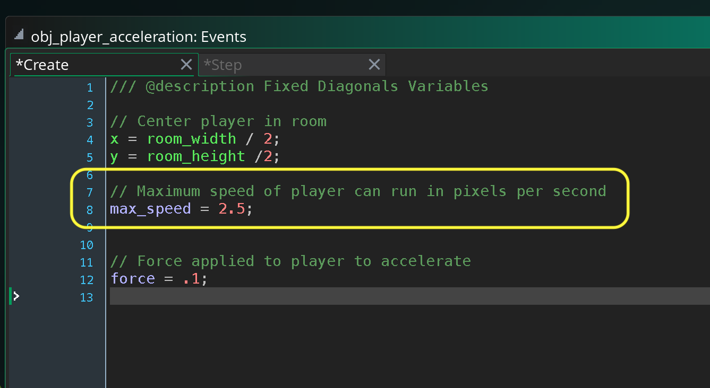
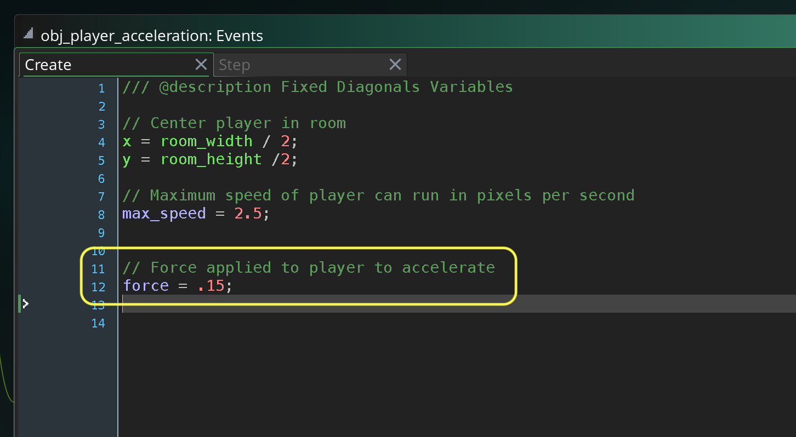

### Player Acceleration

<sub>[previous](../diagonal-8dir/README.md#user-content-diagonals-with-8-directions) • [home](../README.md#user-content-gms2-move-in-8-directions) • [next](../)</sub>


Right now our player hits max acceleration instantly.  So they can go from standing to running at full speed in one frame.  Lets add a force so the player has to accelerate to get to full speed adding a bit more realism to the animation and feel of the character.

<br>

---


##### `Step 1.`\|`MI8D`|:small_blue_diamond:

*Right click* on **Sprites** and select **New | Sprite** and name it `spr_player_3`. Press the <kbd>Edit Image</kbd> button and create another player with a unique color.  Make sure the **Origin** is set to `Middle Center`.


##### `Step 2.`\|`FHIU`|:small_blue_diamond: :small_blue_diamond: 

*Right click* on **obj_player_diagonals** and select **Duplicate**.  Call this new object `obj_player_acceleration`. Assign the **Sprite** `spr_player_3`.  Open up the **Create Event** and add a variable called `force`. This will be a weak force as it will be added together each frame.  So even a small number like `.1` will take (2.5 / .1) 25 frames to get to our previous speed of **2.5**.  Now at the default of 60FPS that means that it will take a bit less than half a second.


##### `Step 3.`\|`MI8D`|:small_blue_diamond: :small_blue_diamond: :small_blue_diamond:

Now open up the **Step Event** and change `speed = p_speed;` to `speed += force;`.  So instead of going to max speed right away we are adding a force each frame.  Rember that `+=` is the same thing as typing `speed = speed + force;` in shorthand.


##### `Step 4.`\|`MI8D`|:small_blue_diamond: :small_blue_diamond: :small_blue_diamond: :small_blue_diamond:

*Right click* on **Rooms** and select **New | Room** and name it `rm_acceleration`. Drag a copy of **obj_player_acceleration** to the room.


##### `Step 5.`\|`MI8D`| :small_orange_diamond:

Open up **obj_game | Draw Gui** event and add the title `Player with Acceleration` to the script's **switch** statement.


##### `Step 6.`\|`MI8D`| :small_orange_diamond: :small_blue_diamond:

Now *press* the <kbd>Play</kbd> button in the top menu bar to launch the game. Now you notice the player gets faster each frame.  The problem is that the player keeps accelerating and never hits their top speed.


##### `Step 7.`\|`MI8D`| :small_orange_diamond: :small_blue_diamond: :small_blue_diamond:

Open up **obj_player_diagonals | Create** event and lets refactor our code.  Now it is no longer appropriate to call the variable `p_speed`.  Lets chnage the name to `max_speed`.  This better expresses that this is the maximum speed we want the player to get up to. 




##### `Step 8.`\|`MI8D`| :small_orange_diamond: :small_blue_diamond: :small_blue_diamond: :small_blue_diamond:

Open up the **Step** event and we will use the **[clamp(val, min, max)](https://manual.yoyogames.com/GameMaker_Language/GML_Reference/Maths_And_Numbers/Number_Functions/clamp.htm)** to clamp the maximum speed. 

This function returns the clamped value.  So we send the function our own variable that we want to clamp's current value and it will stop it from going below the **min** or above the **max**.  So we want to clamp **speed** between `0` and `max_speed` (2.5).

```
speed = clamp(speed, 0, max_speed);
``` 


##### `Step 9.`\|`MI8D`| :small_orange_diamond: :small_blue_diamond: :small_blue_diamond: :small_blue_diamond: :small_blue_diamond:

Now *press* the <kbd>Play</kbd> button in the top menu bar to launch the game. Now play the game and notice that there is a feeling of acceleration but we do not go faster than our maximum speed set.


##### `Step 10.`\|`MI8D`| :large_blue_diamond:

Now there is an issue.  Open up **obj_player_diagonals | Create** event and change the **force** to `.01` to exagerate the change. 

Now *press* the <kbd>Play</kbd> button in the top menu bar to launch the game. Now moving from one direction to diagonals is snappy and fast and feels good.  But when I turn 180° I lift one finger and raise the other.  So it freezes the player then adds another acceleration making turning very sluggish.


##### `Step 11.`\|`MI8D`| :large_blue_diamond: :small_blue_diamond: 

So open up **obj_player_diagonals | Step** event. Before we set a new direction create a temporary local variable `var old_direciton` to the current direction.  Then we will set the new direction. 

Before we set the speed add a boost so that that the player isn't starting from 0 again. We have an issue though that when we subtract the **direction** to find out if we are moving 180° we might be subtracting 180° - 0 or 0 - 180°.  This gives us a result of 180° or -180°.  We use **abs** to remove the sign so we can subtract the direction, remove the sign then compare to see if it is equal to 180°.  If it is then we apply a boost of half the max speed.


##### `Step 12.`\|`MI8D`| :large_blue_diamond: :small_blue_diamond: :small_blue_diamond: 

Now *press* the <kbd>Play</kbd> button in the top menu bar to launch the game. If you are quick enough when you turn 180 we change directions much faster and it feels a **LOT** better which is what we are looking for.


##### `Step 13.`\|`MI8D`| :large_blue_diamond: :small_blue_diamond: :small_blue_diamond:  :small_blue_diamond: 

Now that we have diagnosed that problem we can put `force` back to an amount that feels right to you.  I kind of like `.15`.




##### `Step 14.`\|`MI8D`| :large_blue_diamond: :small_blue_diamond: :small_blue_diamond: :small_blue_diamond:  :small_blue_diamond: 

*Right click* **obj_player_acceleration** and select **Duplicate**.  Call the new sprite `obj_player_acceleration_8Dir`.  Assign the sprite **spr_player_idle_0**.


##### `Step 15.`\|`MI8D`| :large_blue_diamond: :small_orange_diamond: 

*Right click* on **Rooms** and select **New | Room** and name it `rm_acceleration_8Dir`. Add **obj_player_acceleration_8Dir** to the room.


##### `Step 16.`\|`MI8D`| :large_blue_diamond: :small_orange_diamond:   :small_blue_diamond: 

Open up **obj_game | Draw Gui** event and add the title `Player with Acceleration in 8 directions with Idle` to the script's **switch** statement.


##### `Step 17.`\|`MI8D`| :large_blue_diamond: :small_orange_diamond: :small_blue_diamond: :small_blue_diamond:

Now open up the **obj_player_acceleration_8Dir | End Step** event and:

1.  Check to see if player is moving
2.  If they are call the `set_walk_animation()` function.
2.  If not call the `set_idle_walk_animation()` function.


##### `Step 18.`\|`MI8D`| :large_blue_diamond: :small_orange_diamond: :small_blue_diamond: :small_blue_diamond: :small_blue_diamond:

Now *press* the <kbd>Play</kbd> button in the top menu bar to launch the game. Now notice that the player animation plays at the same speed regardless of what speed the player is at.  So it looks like they are skating while accelerating and it looks wrong (I lowered the force for the player to `.01` to exaggerate the effect for the below video).


##### `Step 19.`\|`MI8D`| :large_blue_diamond: :small_orange_diamond: :small_blue_diamond: :small_blue_diamond: :small_blue_diamond: :small_blue_diamond:


##### `Step 20.`\|`MI8D`| :large_blue_diamond: :large_blue_diamond:


##### `Step 21.`\|`MI8D`| :large_blue_diamond: :large_blue_diamond: :small_blue_diamond:


___


| [previous](../diagonal-8dir/README.md#user-content-diagonals-with-8-directions)| [home](../README.md#user-content-gms2-move-in-8-directions) | [next](../)|
|---|---|---|
