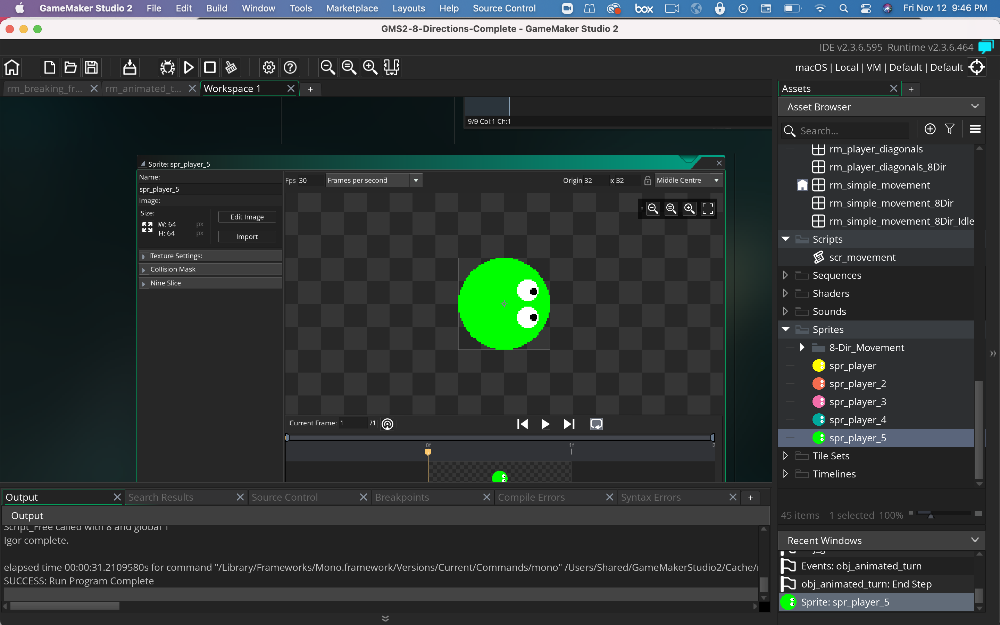
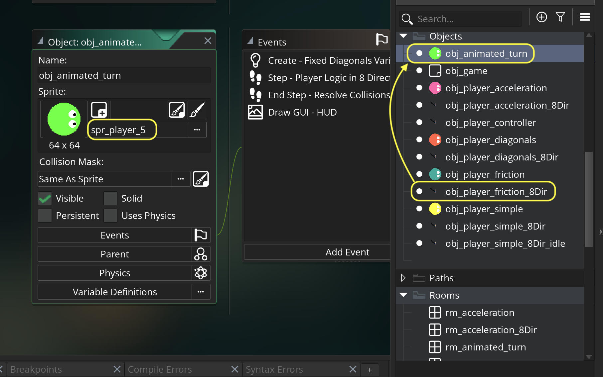
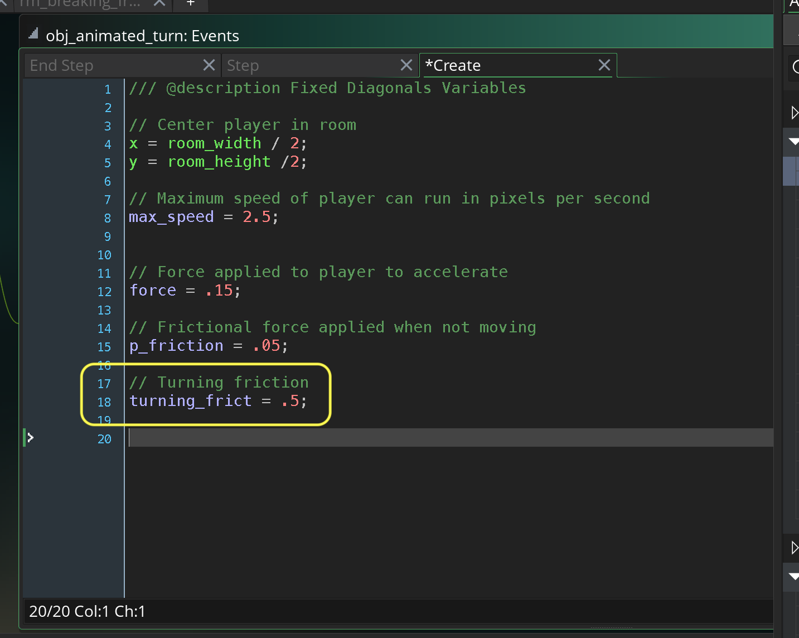
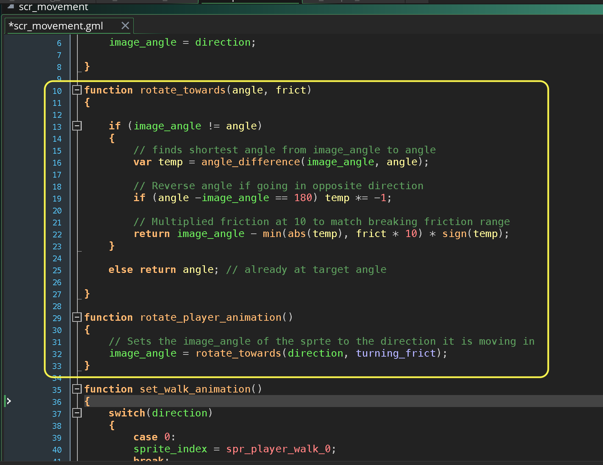
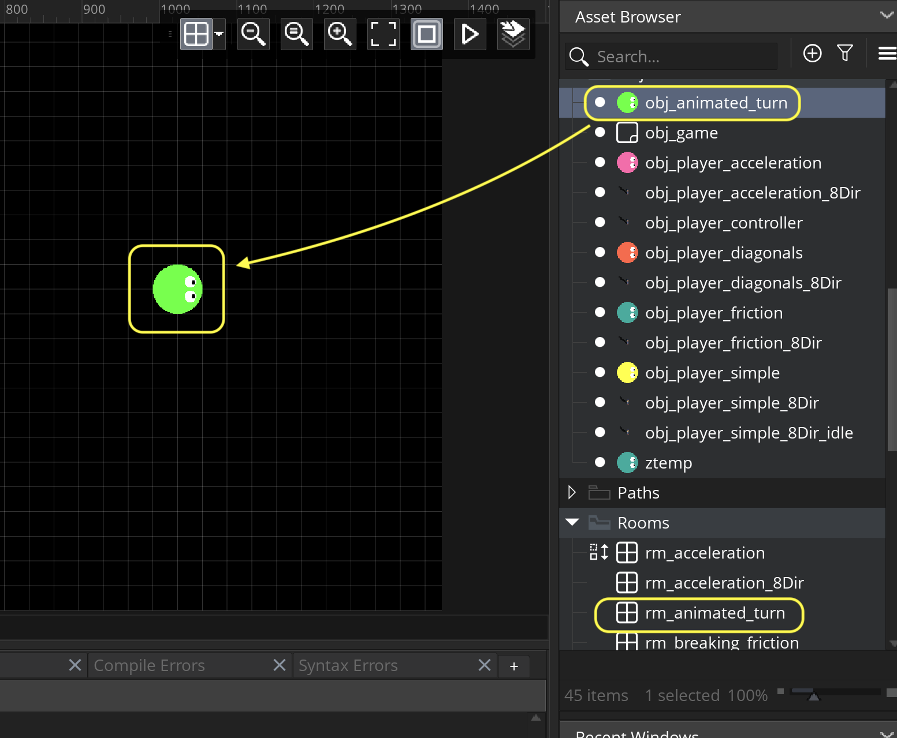
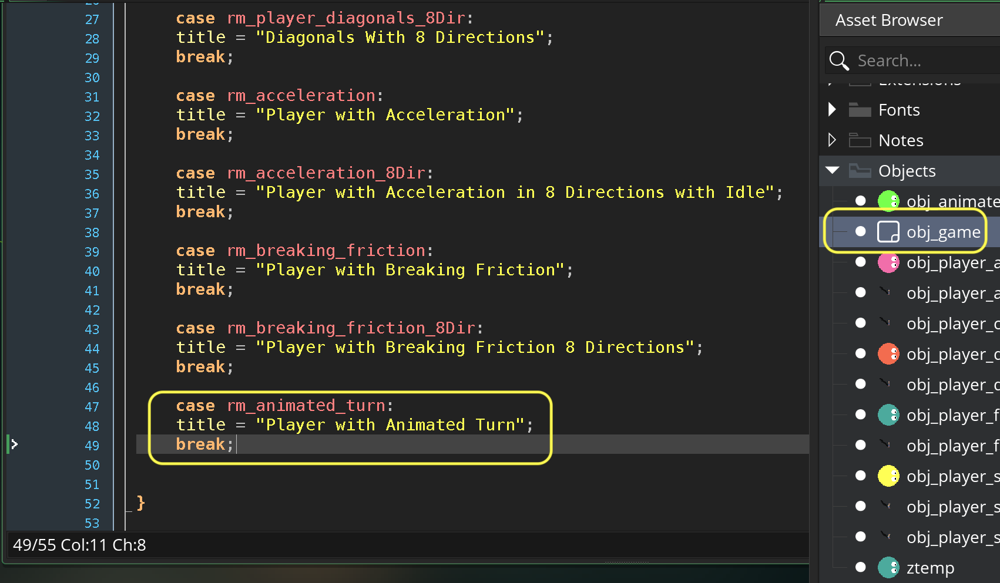
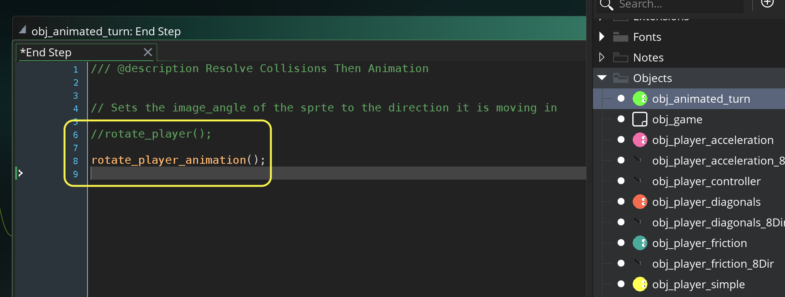
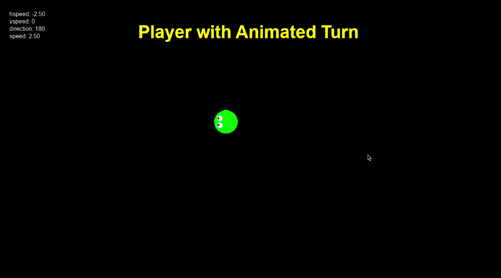

### Animated Turn

[previous](../breaking-friction/README.md#user-content-player-breaking-friction) • [home](../README.md#user-content-gms2-move-in-8-directions) • [next](../gamepad/README.md#user-content-gamepad)

In a top down game without different angles of animation look much better when we animated between the direction we are pointing in as opposed to snapping to it. Lets give it a shot.

 

---

##### `Step 1.`\|`MI8D`|:small_blue_diamond:

*Right click* on **Sprites** and select **New | Sprite** and name it `spr_player_5`. Press the <kbd>Edit Image</kbd> button and create another player with a unique color.  Make sure the **Origin** is set to `Middle Center`.

##### `Step 2.`\|`FHIU`|:small_blue_diamond: :small_blue_diamond: 

*Right click* on **obj_player_friction** and select **Duplicate**.  Call this new object `obj_animated_turn`. Assign the **Sprite** `spr_player_5`.

##### `Step 3.`\|`MI8D`|:small_blue_diamond: :small_blue_diamond: :small_blue_diamond:

Open up **obj_animated_turn | Create** event and add a variable that adjusts the speed of the turn called `turning_frict`

##### `Step 4.`\|`MI8D`|:small_blue_diamond: :small_blue_diamond: :small_blue_diamond: :small_blue_diamond:

##### `Step 5.`\|`MI8D`| :small_orange_diamond:

*Right click* on **Rooms** and select **New | Room** and name it `rm_animated_turn`.  I then dragged a copy of **obj_animated_turn** into the room.

##### `Step 6.`\|`MI8D`| :small_orange_diamond: :small_blue_diamond:

##### `Step 7.`\|`MI8D`| :small_orange_diamond: :small_blue_diamond: :small_blue_diamond:

##### `Step 8.`\|`MI8D`| :small_orange_diamond: :small_blue_diamond: :small_blue_diamond: :small_blue_diamond:

##### `Step 9.`\|`MI8D`| :small_orange_diamond: :small_blue_diamond: :small_blue_diamond: :small_blue_diamond: :small_blue_diamond:

Select the **File | Save Project** then press **File | Quit** to make sure everything in the game is saved. If you are using **GitHub** open up **GitHub Desktop** and add a title and longer description (if necessary) and press the <kbd>Commit to main</kbd> button. Finish by pressing **Push origin** to update the server with the latest changes.

___

| [previous](../breaking-friction/README.md#user-content-player-breaking-friction)| [home](../README.md#user-content-gms2-move-in-8-directions) | [next](../gamepad/README.md#user-content-gamepad)|
|---|---|---|
