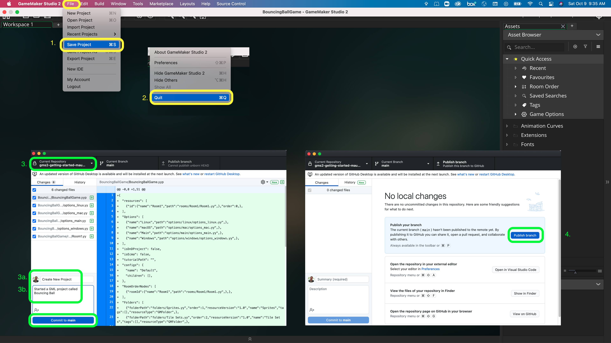

### Animated Turn

<sub>[previous](../breaking-friction/README.md#user-content-player-breaking-friction) • [home](../README.md#user-content-gms2-move-in-8-directions)


In a top down game without different angles of animation look much better when we animated between the direction we are pointing in as opposed to snapping to it. Lets give it a shot.

<br>

---


##### `Step 1.`\|`MI8D`|:small_blue_diamond:

*Right click* on **Sprites** and select **New | Sprite** and name it `spr_player_5`. Press the <kbd>Edit Image</kbd> button and create another player with a unique color.  Make sure the **Origin** is set to `Middle Center`.


##### `Step 2.`\|`FHIU`|:small_blue_diamond: :small_blue_diamond: 

*Right click* on **obj_player_friction** and select **Duplicate**.  Call this new object `obj_animated_turn`. Assign the **Sprite** `spr_player_5`.


##### `Step 3.`\|`MI8D`|:small_blue_diamond: :small_blue_diamond: :small_blue_diamond:

Open up **obj_animated_turn | Create** event and add a variable that adjusts the speed of the turn called `turning_frict`


##### `Step 4.`\|`MI8D`|:small_blue_diamond: :small_blue_diamond: :small_blue_diamond: :small_blue_diamond:

Open up **scr_movement**. Lets add a new function called `rotate_towards(angle, frict)`.  **angle** is the angle we would like to change to and **frict** is the speed we get there.  The lower the number, the slower we turn, the larger the number the faster we turn.

First we check to see that we are not already pointing in the correct direction.  If we are we just return the angle unchanged.  If not:

```
var temp = angle_difference(image_angle, angle);
```

We need to find the fastest route between two angles,  So if the angle is 90° apart, we not want to rotate -270° we want to take the shortest route either clockwise or counter clockwise.  This is what the **angle_difference(image_anlge, angle)** function returns the quickest angle to our destination!

```
if (angle - image_angle == 180) temp *= -1;
```
This is done so that the image flips rotation when moving positive 180 degrees.  It looks a little bit better to my eyes, but is not absolutely necessary.

```
temp = image_angle - min(abs(temp), frict * 10) * sign(temp);
```

This is not as complicated as it looks.  Now our **temp** target could be positive or negative.  So we need to subtract from our image_angle a positive **temp**.  This is what **abs()** does, it removes the sign.  Now for the last step it will overshoot the target if the difference isn't precise.  So we take the smallest mumber the temp, or frict * 10 to get precisely to the target.  We then multiply it by `-1` or `1` which is what **sign(temp)** does. We scale this number by a factor of 10 to bring the turning speed into a similar range as our `force` and `p_friction` ranges.

We return the final degree in angles and **mod** it by 360 which keeps the range to stay within -360 to 360.

We create a seperate function that calls this method named `rotate_player_animation`.  This will set the `image_angle` to the next angle closer to its desired target (`direction`).  This does not create any issues with the physics and is purely a visual effect.


##### `Step 5.`\|`MI8D`| :small_orange_diamond:

*Right click* on **Rooms** and select **New | Room** and name it `rm_animated_turn`.  I then dragged a copy of **obj_animated_turn** into the room.


##### `Step 6.`\|`MI8D`| :small_orange_diamond: :small_blue_diamond:

Open up **obj_game | Draw GUI** animaton and add a title `Player with Animated Turn` to the level.


##### `Step 7.`\|`MI8D`| :small_orange_diamond: :small_blue_diamond: :small_blue_diamond:

Open up **obj_animated_turn | End Step** event and delete or comment out the calling of function `rotate_player()` and instead call `rotate_player_animation();`.


##### `Step 8.`\|`MI8D`| :small_orange_diamond: :small_blue_diamond: :small_blue_diamond: :small_blue_diamond:

Now *press* the <kbd>Play</kbd> button in the top menu bar to launch the game. Look at how nicely the player turns making the entire game look much smoother.


##### `Step 9.`\|`MI8D`| :small_orange_diamond: :small_blue_diamond: :small_blue_diamond: :small_blue_diamond: :small_blue_diamond:

Select the **File | Save Project** then press **File | Quit** to make sure everything in the game is saved. If you are using **GitHub** open up **GitHub Desktop** and add a title and longer description (if necessary) and press the <kbd>Commit to main</kbd> button. Finish by pressing **Push origin** to update the server with the latest changes.



___


| [previous](../breaking-friction/README.md#user-content-player-breaking-friction)| [home](../README.md#user-content-gms2-move-in-8-directions) | 
|---|---|
