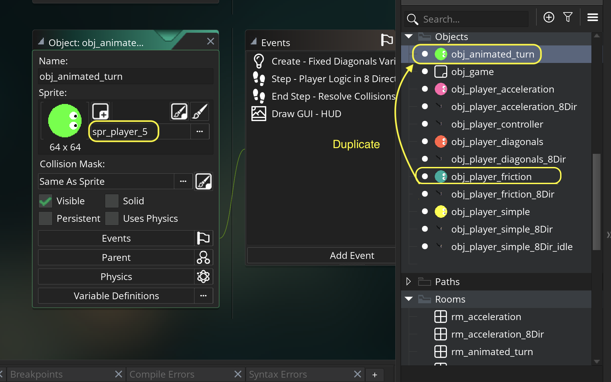

### Animated Turn

[previous](../breaking-friction/README.md#user-content-player-breaking-friction) • [home](../README.md#user-content-gms2-move-in-8-directions) • [next](../gamepad/README.md#user-content-gamepad)

In a top down game without different angles of animation look much better when we animated between the direction we are pointing in as opposed to snapping to it. Lets give it a shot.

 

---

##### `Step 1.`\|`MI8D`|:small_blue_diamond:

*Right click* on **Sprites** and select **New | Sprite** and name it `spr_player_5`. Press the <kbd>Edit Image</kbd> button and create another player with a unique color.  Make sure the **Origin** is set to `Middle Center`.

##### `Step 2.`\|`FHIU`|:small_blue_diamond: :small_blue_diamond: 

*Right click* on **obj_player_friction** and select **Duplicate**.  Call this new object `obj_animated_turn`. Assign the **Sprite** `spr_player_5`.

##### `Step 3.`\|`MI8D`|:small_blue_diamond: :small_blue_diamond: :small_blue_diamond:

Open up **obj_animated_turn | Create** event and add a variable that adjusts the speed of the turn called `turning_frict`

##### `Step 4.`\|`MI8D`|:small_blue_diamond: :small_blue_diamond: :small_blue_diamond: :small_blue_diamond:

##### `Step 5.`\|`MI8D`| :small_orange_diamond:

##### `Step 6.`\|`MI8D`| :small_orange_diamond: :small_blue_diamond:

##### `Step 7.`\|`MI8D`| :small_orange_diamond: :small_blue_diamond: :small_blue_diamond:

##### `Step 8.`\|`MI8D`| :small_orange_diamond: :small_blue_diamond: :small_blue_diamond: :small_blue_diamond:

##### `Step 9.`\|`MI8D`| :small_orange_diamond: :small_blue_diamond: :small_blue_diamond: :small_blue_diamond: :small_blue_diamond:

##### `Step 10.`\|`MI8D`| :large_blue_diamond:

##### `Step 11.`\|`MI8D`| :large_blue_diamond: :small_blue_diamond: 

##### `Step 12.`\|`MI8D`| :large_blue_diamond: :small_blue_diamond: :small_blue_diamond: 

##### `Step 13.`\|`MI8D`| :large_blue_diamond: :small_blue_diamond: :small_blue_diamond:  :small_blue_diamond: 

##### `Step 14.`\|`MI8D`| :large_blue_diamond: :small_blue_diamond: :small_blue_diamond: :small_blue_diamond:  :small_blue_diamond: 

##### `Step 15.`\|`MI8D`| :large_blue_diamond: :small_orange_diamond: 

##### `Step 16.`\|`MI8D`| :large_blue_diamond: :small_orange_diamond:   :small_blue_diamond: 

##### `Step 17.`\|`MI8D`| :large_blue_diamond: :small_orange_diamond: :small_blue_diamond: :small_blue_diamond:

##### `Step 18.`\|`MI8D`| :large_blue_diamond: :small_orange_diamond: :small_blue_diamond: :small_blue_diamond: :small_blue_diamond:

##### `Step 19.`\|`MI8D`| :large_blue_diamond: :small_orange_diamond: :small_blue_diamond: :small_blue_diamond: :small_blue_diamond: :small_blue_diamond:

##### `Step 20.`\|`MI8D`| :large_blue_diamond: :large_blue_diamond:

##### `Step 21.`\|`MI8D`| :large_blue_diamond: :large_blue_diamond: :small_blue_diamond:

___

| [previous](../breaking-friction/README.md#user-content-player-breaking-friction)| [home](../README.md#user-content-gms2-move-in-8-directions) | [next](../gamepad/README.md#user-content-gamepad)|
|---|---|---|
