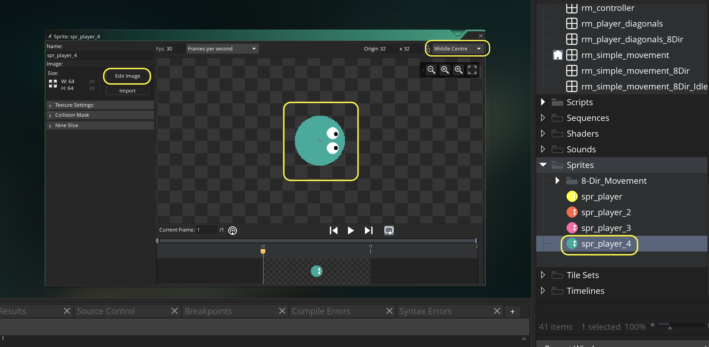
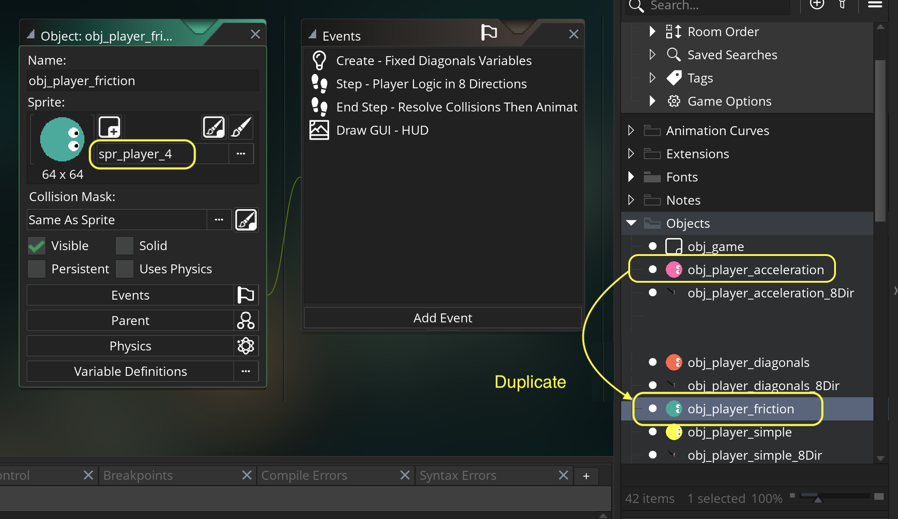
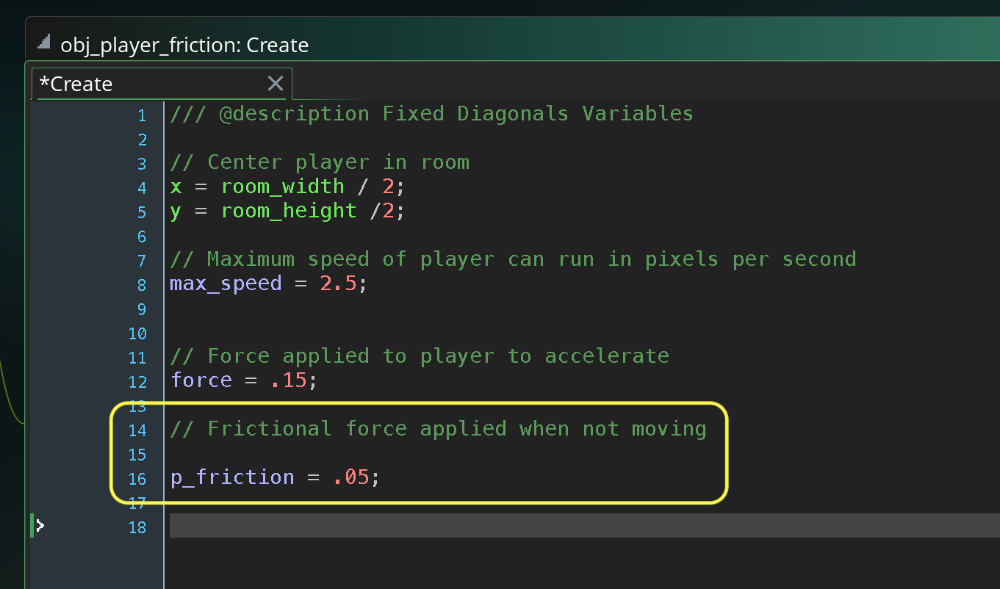
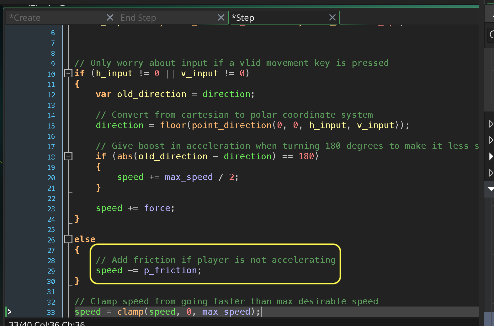

### Player Breaking Friction

[previous](../acceleration/README.md#user-content-player-acceleration) • [home](../README.md#user-content-gms2-move-in-8-directions) • [next](../)

Now that we have the player accelerating, it is a bit jolting to have the player come to an immediate stop.  Lets add some breaking friction so the player slows down before they stop.

 

---

##### `Step 1.`\|`MI8D`|:small_blue_diamond:

*Right click* on **Sprites** and select **New | Sprite** and name it `spr_player_4`. Press the <kbd>Edit Image</kbd> button and create another player with a unique color.  Make sure the **Origin** is set to `Middle Center`.

##### `Step 2.`\|`FHIU`|:small_blue_diamond: :small_blue_diamond: 

*Right click* on **obj_player_acceleration** and select **Duplicate**.  Call this new object `obj_player_friction`. Assign the **Sprite** `spr_player_4`.  

##### `Step 3.`\|`MI8D`|:small_blue_diamond: :small_blue_diamond: :small_blue_diamond:

Open up **obj_player_friction | Create** event and add a variable for friction called `p_friction`.  This is a week force otherwise the acceleration wouldn't overcome the friction.

##### `Step 4.`\|`MI8D`|:small_blue_diamond: :small_blue_diamond: :small_blue_diamond: :small_blue_diamond:

Now open up the **Step** event and lets replace setting the speed to `0` when the player is not moving to reducing the velocity by a small frictional force `p_friction`.

##### `Step 5.`\|`MI8D`| :small_orange_diamond:

##### `Step 6.`\|`MI8D`| :small_orange_diamond: :small_blue_diamond:

##### `Step 7.`\|`MI8D`| :small_orange_diamond: :small_blue_diamond: :small_blue_diamond:

##### `Step 8.`\|`MI8D`| :small_orange_diamond: :small_blue_diamond: :small_blue_diamond: :small_blue_diamond:

##### `Step 9.`\|`MI8D`| :small_orange_diamond: :small_blue_diamond: :small_blue_diamond: :small_blue_diamond: :small_blue_diamond:

##### `Step 10.`\|`MI8D`| :large_blue_diamond:

##### `Step 11.`\|`MI8D`| :large_blue_diamond: :small_blue_diamond: 

##### `Step 12.`\|`MI8D`| :large_blue_diamond: :small_blue_diamond: :small_blue_diamond: 

##### `Step 13.`\|`MI8D`| :large_blue_diamond: :small_blue_diamond: :small_blue_diamond:  :small_blue_diamond: 

##### `Step 14.`\|`MI8D`| :large_blue_diamond: :small_blue_diamond: :small_blue_diamond: :small_blue_diamond:  :small_blue_diamond: 

##### `Step 15.`\|`MI8D`| :large_blue_diamond: :small_orange_diamond: 

##### `Step 16.`\|`MI8D`| :large_blue_diamond: :small_orange_diamond:   :small_blue_diamond: 

##### `Step 17.`\|`MI8D`| :large_blue_diamond: :small_orange_diamond: :small_blue_diamond: :small_blue_diamond:

##### `Step 18.`\|`MI8D`| :large_blue_diamond: :small_orange_diamond: :small_blue_diamond: :small_blue_diamond: :small_blue_diamond:

##### `Step 19.`\|`MI8D`| :large_blue_diamond: :small_orange_diamond: :small_blue_diamond: :small_blue_diamond: :small_blue_diamond: :small_blue_diamond:

##### `Step 20.`\|`MI8D`| :large_blue_diamond: :large_blue_diamond:

##### `Step 21.`\|`MI8D`| :large_blue_diamond: :large_blue_diamond: :small_blue_diamond:

___

| [previous](../acceleration/README.md#user-content-player-acceleration)| [home](../README.md#user-content-gms2-move-in-8-directions) | [next](../)|
|---|---|---|
