### Diagonals with 8 Directions

[previous](../diagonal-speed/README.md#user-content-diagonal-speed-fix) • [home](../README.md#user-content-gms2-move-in-8-directions) • [next](../)

Now lets add the 8 sides animations instead of rotating the player to this superior movement model.

 

---

##### `Step 1.`\|`MI8D`|:small_blue_diamond:

Right click on **obj_player_diagonals** and select **Duplicate** then call the new object `obj_player_diagonals_8Dir`.

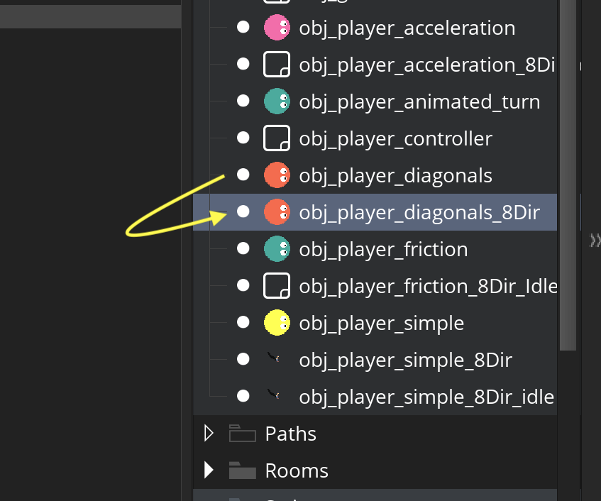

##### `Step 2.`\|`FHIU`|:small_blue_diamond: :small_blue_diamond: 

Assign `spr_player_idle_0` as the default sprite so that it looks good in the room editor.

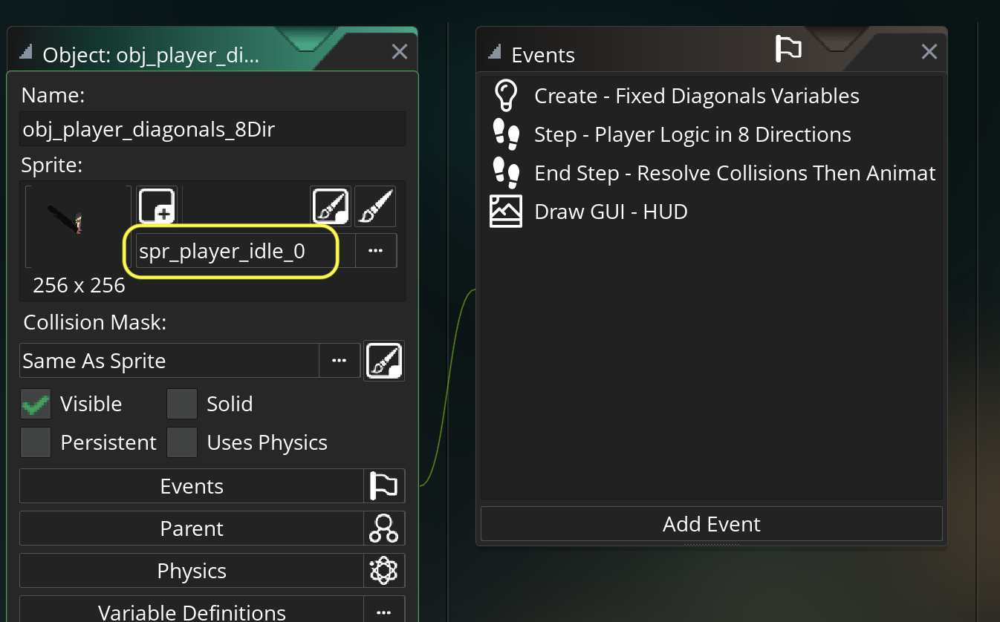

##### `Step 3.`\|`MI8D`|:small_blue_diamond: :small_blue_diamond: :small_blue_diamond:

Open up **obj_player_simple_8Dir | End Step** event.  Copy and paste the **Switch(Direction)** for walking.  Open up `scr_movement`.  Create a new function called `function set_walk_animation()`.  We will paste the contents of the switch statement into this function.

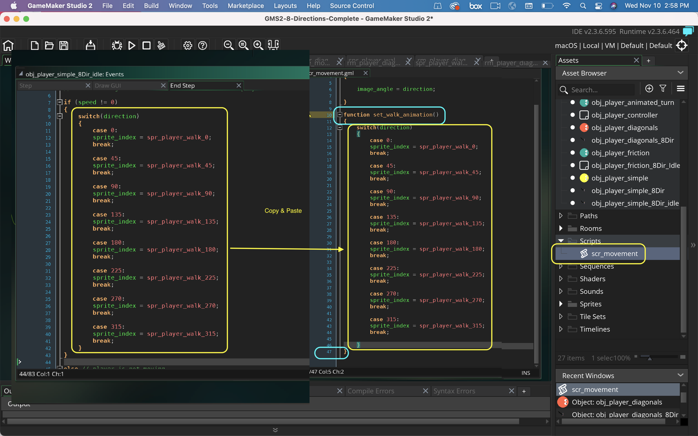

##### `Step 4.`\|`MI8D`|:small_blue_diamond: :small_blue_diamond: :small_blue_diamond: :small_blue_diamond:

Open up **obj_player_diagonals_8Dir** and in the **End Step** event comment out or delete the call to  `rotate_player()`.  Instead:

1. Check if player is moving
2. Call `set_walk_animation();` function
 
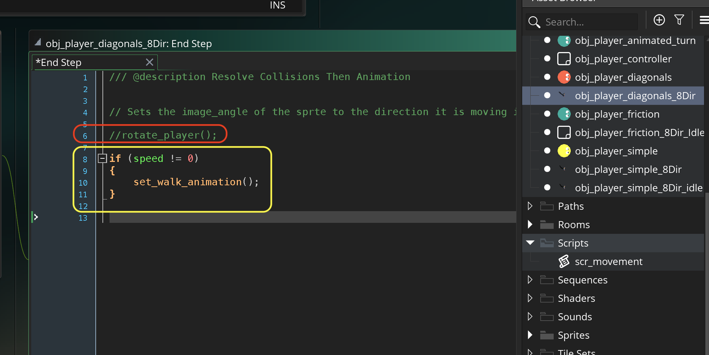

##### `Step 5.`\|`MI8D`| :small_orange_diamond:

Add a new **Room** called `rm_player_diagonals_8Dir`.  Drag an instance of **obj_player_diagonals_8Dir** into the room.

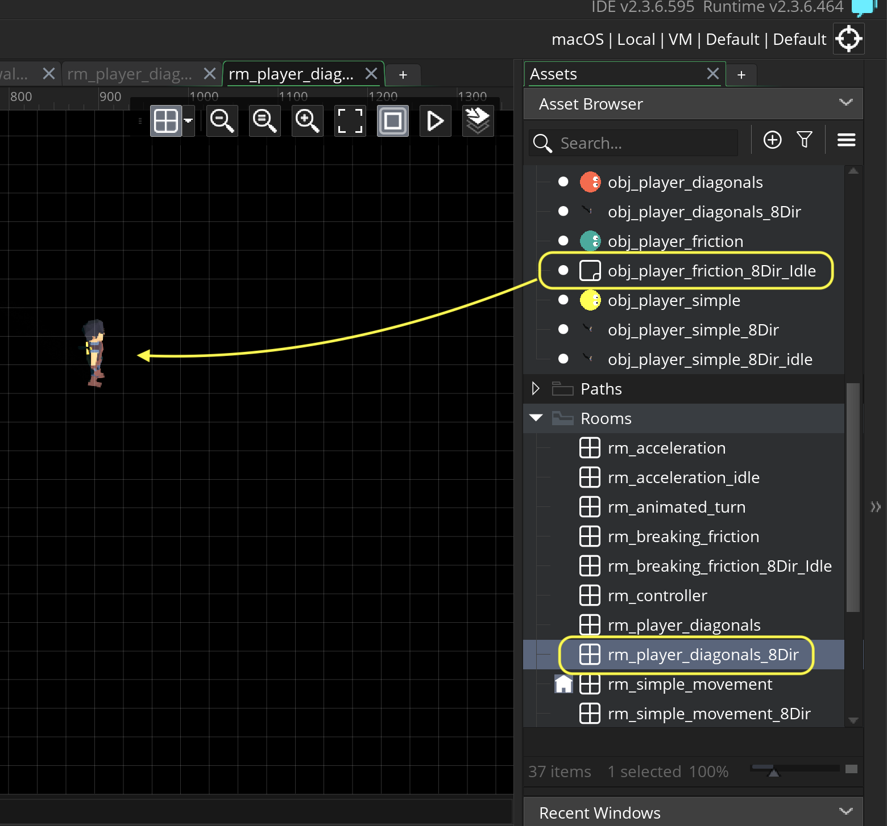

##### `Step 6.`\|`MI8D`| :small_orange_diamond: :small_blue_diamond:

Open up **obj_game** and add a title called **Diagonals with 8 Directions**.

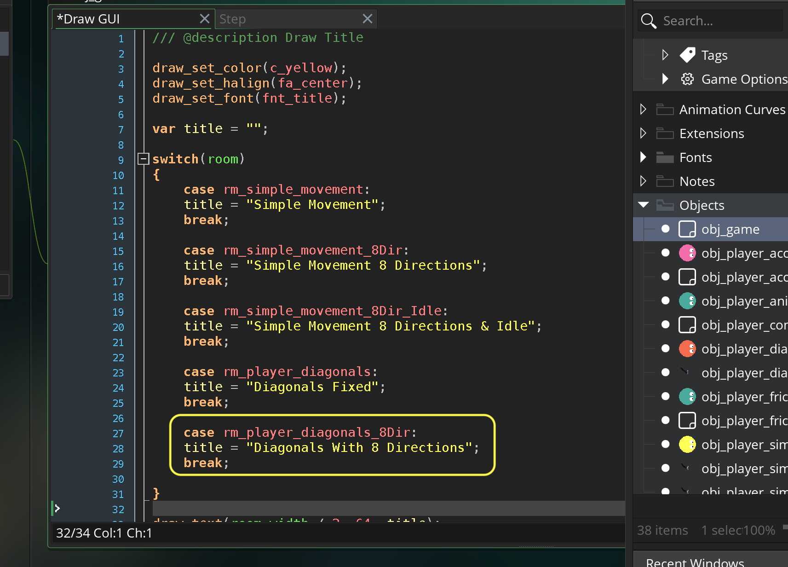

##### `Step 7.`\|`MI8D`| :small_orange_diamond: :small_blue_diamond: :small_blue_diamond:

Now *press* the <kbd>Play</kbd> button in the top menu bar to launch the game. Now press the <kbd>Space Bar</kbd> and go to the diagonals room. Now run around and you should have the correct animation playing for walk, but we are missing an idle animation for when they are stopped.

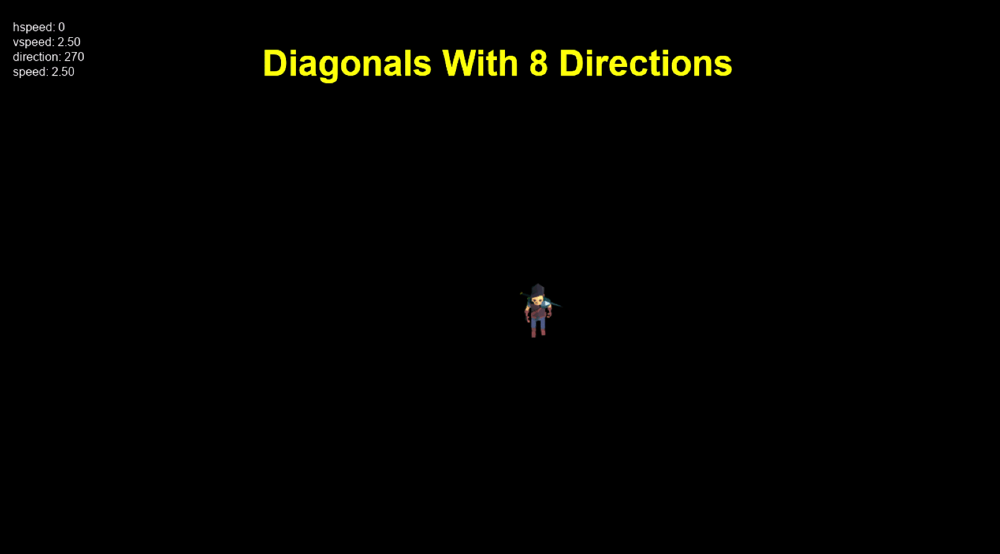

##### `Step 8.`\|`MI8D`| :small_orange_diamond: :small_blue_diamond: :small_blue_diamond: :small_blue_diamond:

Now open up **scr_movement** and add another function called `set_idle_animation()`.  Copy and paste the **Switch** statement for idle animations in **obj_player_simple_8Dir_idle** into the function.

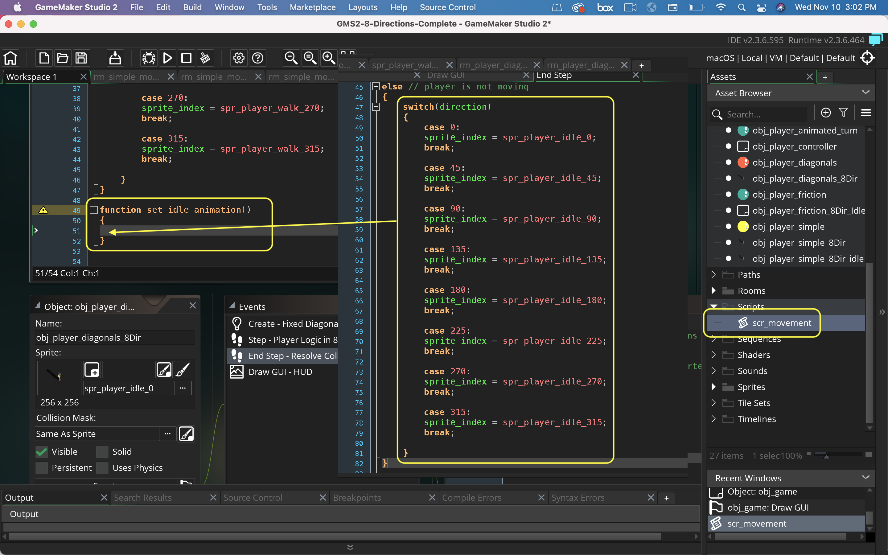

##### `Step 9.`\|`MI8D`| :small_orange_diamond: :small_blue_diamond: :small_blue_diamond: :small_blue_diamond: :small_blue_diamond:

This function sets the sprite to one of the 8 idle animations.

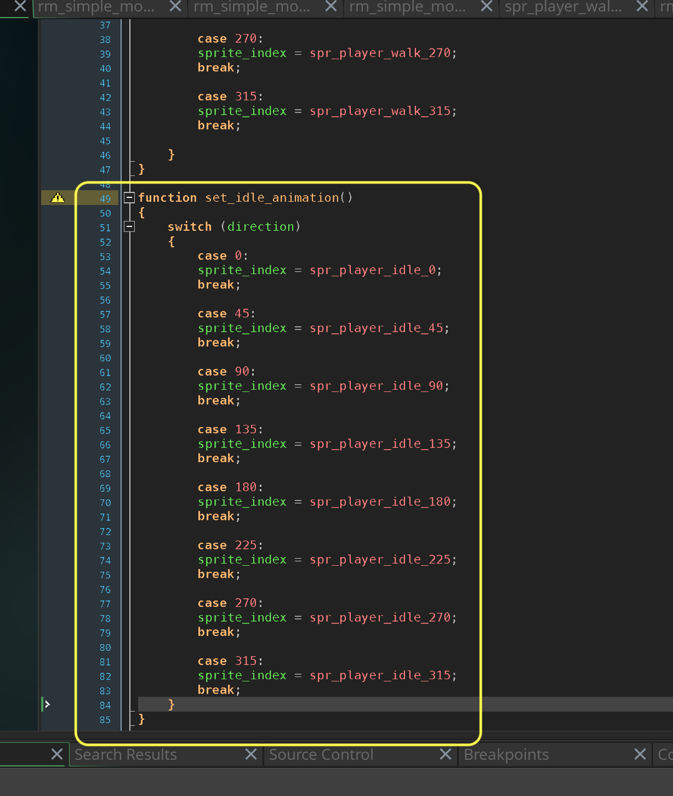

##### `Step 10.`\|`MI8D`| :large_blue_diamond:

Go back to **obj_player_diagonals_8Dir |End Step** event and call `set_idle_animation()` when the player is not moving.

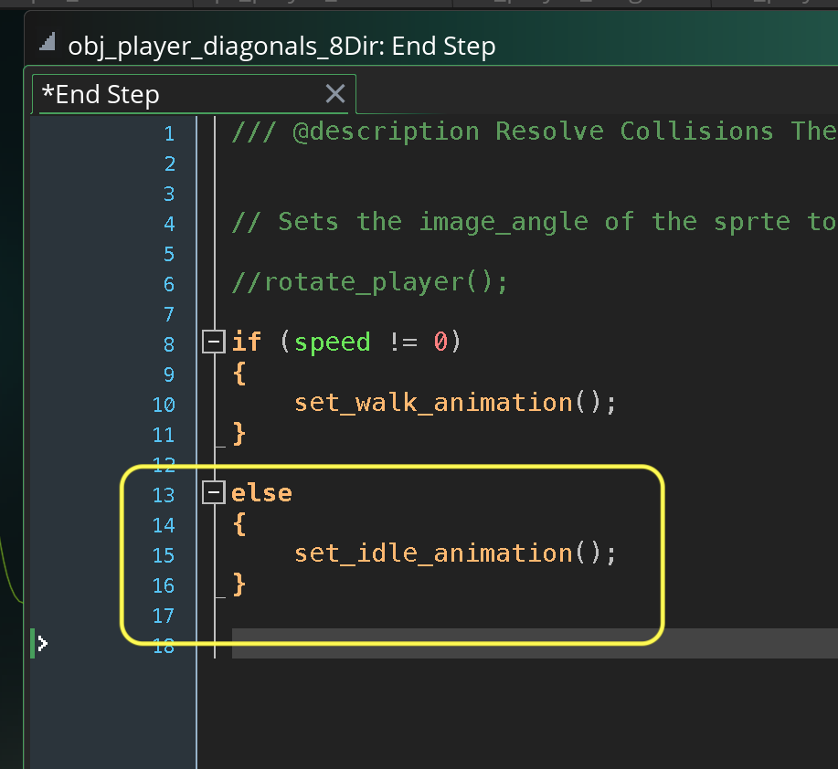

##### `Step 11.`\|`MI8D`| :large_blue_diamond: :small_blue_diamond: 

Now *press* the <kbd>Play</kbd> button in the top menu bar to launch the game. Now press the <kbd>Space Bar</kbd> and go to the diagonals room. Now the player walks and finishes in the correct idle animation.   Also, unlike the simple implementaiton the player doesn't always pop back to facing right fixing one of the previous' main issues.

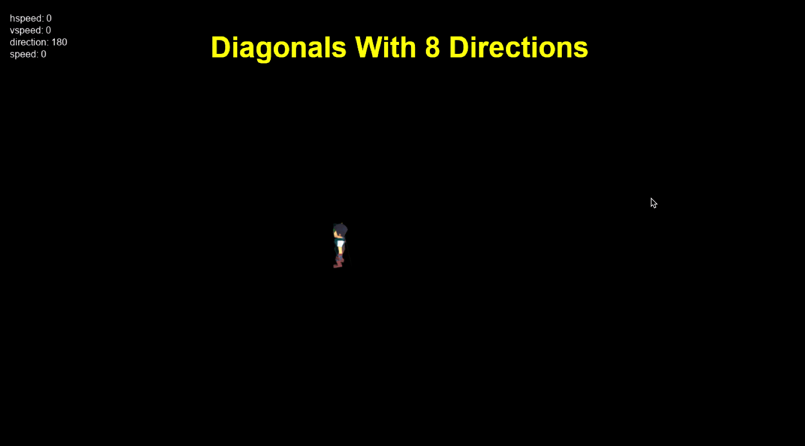

##### `Step 12.`\|`MI8D`| :large_blue_diamond: :small_blue_diamond: :small_blue_diamond: 

Select the **File | Save Project** then press **File | Quit** to make sure everything in the game is saved. If you are using **GitHub** open up **GitHub Desktop** and add a title and longer description (if necessary) and press the <kbd>Commit to main</kbd> button. Finish by pressing **Push origin** to update the server with the latest changes.

___

| [previous](../diagonal-speed/README.md#user-content-diagonal-speed-fix)| [home](../README.md#user-content-gms2-move-in-8-directions) | [next](../)|
|---|---|---|
