### Diagonal Speed Fix

[previous](../simple-8dir/README.md#user-content-simple-movement-8-directions) • [home](../README.md#user-content-gms2-move-in-8-directions) • [next](../)

Now if we are moving at the same magnitude on the horizontal and vertical axis then our speed ends up being 1.414 times faster than in an orthoganal direction.  We can figure this out by applying Pythagorean theorem.  The magnitude will be the square root of (horizontal squared + vertical squared). so the square root of 12 + 12  is 1.414. Lets instead use direction and calculate an angle then give it the same magnitude regardless of the key combination.

 

---

##### `Step 1.`\|`MI8D`|:small_blue_diamond:

*Right click* on **Sprites** and select **New | Sprite** and name it `spr_player_2`. Press the <kbd>Edit Image</kbd> button and draw a top down view of a sprite.  Make it a different color from the first one.  Set the **Origin** to `Middle Center`.

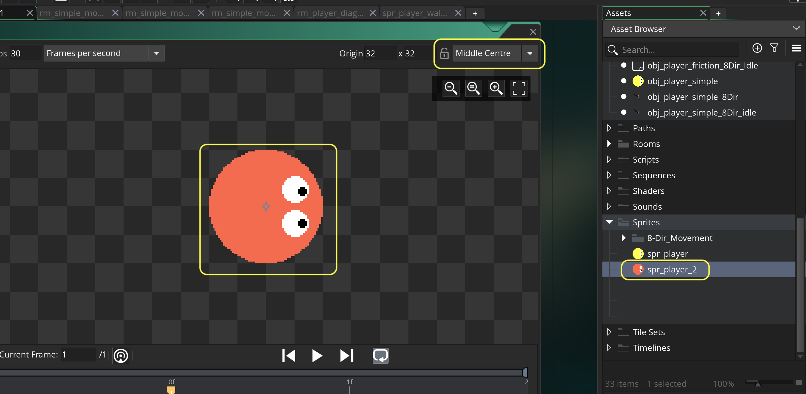

##### `Step 2.`\|`FHIU`|:small_blue_diamond: :small_blue_diamond: 

*Right click* on **Objects** and select **New | Object** and name it `obj_player_diagonals`. Set the **Sprite** to `spr_player_2`.

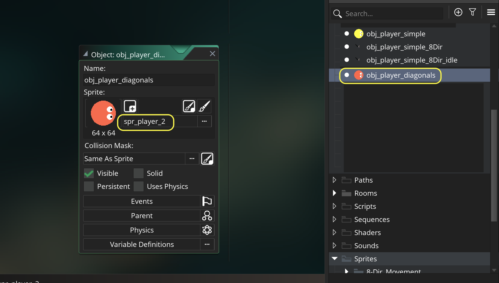

##### `Step 3.`\|`MI8D`|:small_blue_diamond: :small_blue_diamond: :small_blue_diamond:

*Right click* on **Rooms** and select **New | Room** and name it `rm_player_diagonals`. Drag a **obj_player_diagonals** into the new room.

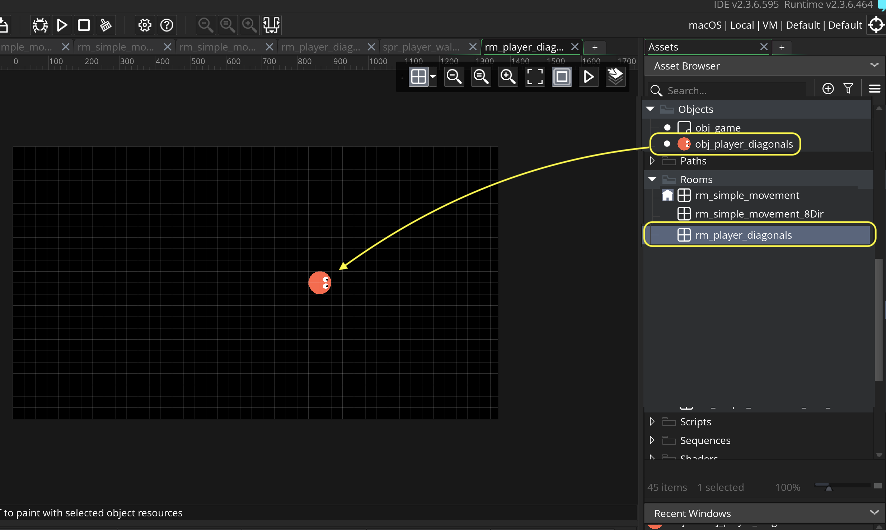

##### `Step 4.`\|`MI8D`|:small_blue_diamond: :small_blue_diamond: :small_blue_diamond: :small_blue_diamond:

*Double click* on **obj_game | Draw GUI** event and add a title for the Diagonals room.

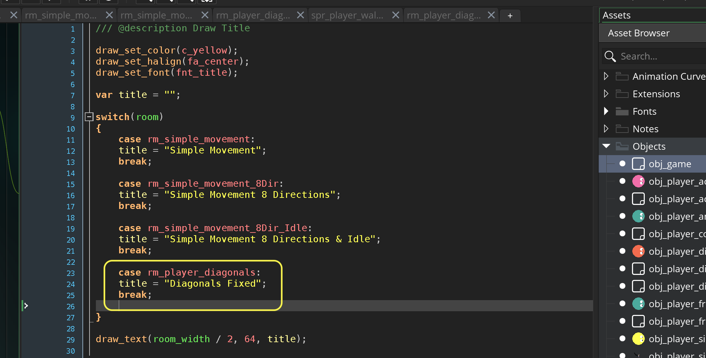

##### `Step 5.`\|`MI8D`| :small_orange_diamond:

Press the <kbd>Add Event</kbd> and select a **Draw | Draw GUI** event. Now lets draw a hud:

1. Select **fnt_hud**
2. Set color to white
3. Left aligh the text
4. Draw a HUD in the top left corner with **hspeed**, **vspeed**, **direction** and **speed**

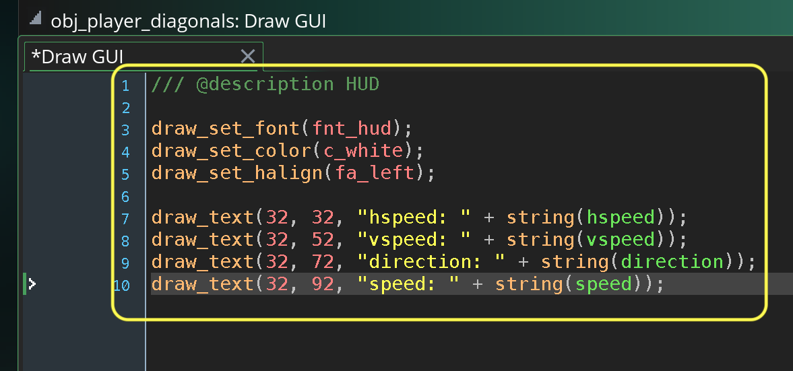

##### `Step 6.`\|`MI8D`| :small_orange_diamond: :small_blue_diamond:

Now *press* the <kbd>Play</kbd> button in the top menu bar to launch the game. Now press the <kbd>Space Bar</kbd> and go to the diagonals room.  All we should have is the player with a title and a HUD and the player does nothing.

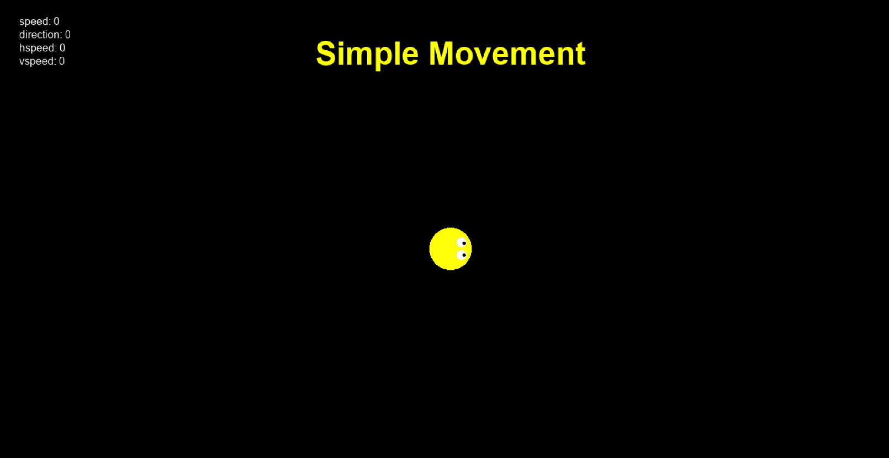

##### `Step 7.`\|`MI8D`| :small_orange_diamond: :small_blue_diamond: :small_blue_diamond:

Open up **obj_player** and press the <kbd>Add Event</kbd> button and add a **Step | Step** event.  Now we will look at **[keyboard_check(key)](https://manual.yoyogames.com/GameMaker_Language/GML_Reference/Game_Input/Keyboard_Input/keyboard_check.htm)** and will subtract the left key from the right key.  Now `keyboard_check(key)` returns a boolean which will be 1 if true and 0 if false.  This means if *right* is pressed it will be *1-0*. If *left* is pressed it will be *0-1*.  If both right and left are pressed it will be 1-1.  So this gives us a range of -1 to 1.

Now what we are going to do is get a direction in degrees based on these two axis.  We are going to convert from cartesian to the polar coordinate system.  So lets look at a controller.  The axis center is (0,0) on the x,y axis.  The end of the vector will be for example (1, -1) on the x,y axis.  This means the player is moving top right or 45°.

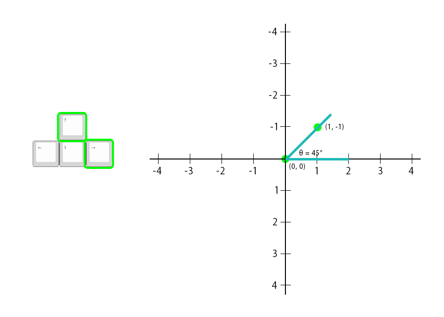

##### `Step 8.`\|`MI8D`| :small_orange_diamond: :small_blue_diamond: :small_blue_diamond: :small_blue_diamond:

To make the above angle conversion we will use **[point_direction(x1, y1, x2, y2)](https://docs.yoyogames.com/source/dadiospice/002_reference/maths/vector%20functions/point_direction.html)** and this function will return the angle in degrees. We will feed this value to the **direction** variable to affect the direction the player is moving in.

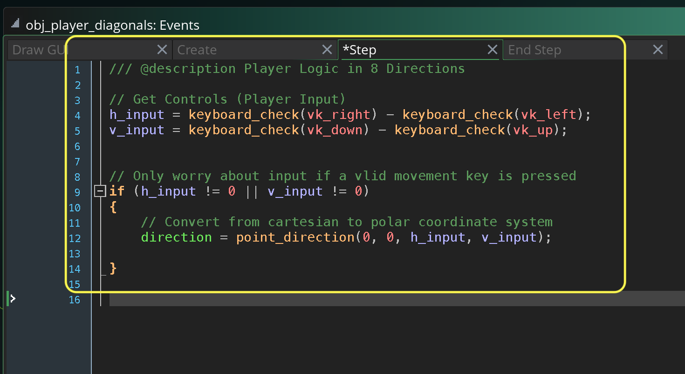

##### `Step 9.`\|`MI8D`| :small_orange_diamond: :small_blue_diamond: :small_blue_diamond: :small_blue_diamond: :small_blue_diamond:

Now *press* the <kbd>Play</kbd> button in the top menu bar to launch the game. Now press the <kbd>Space Bar</kbd> and go to the diagonals room. Now press the arrow keys and look at the result.  Notice that on my computer I am getting a value when I press the <kbd>Left Button</kbd> of `180.00`. 

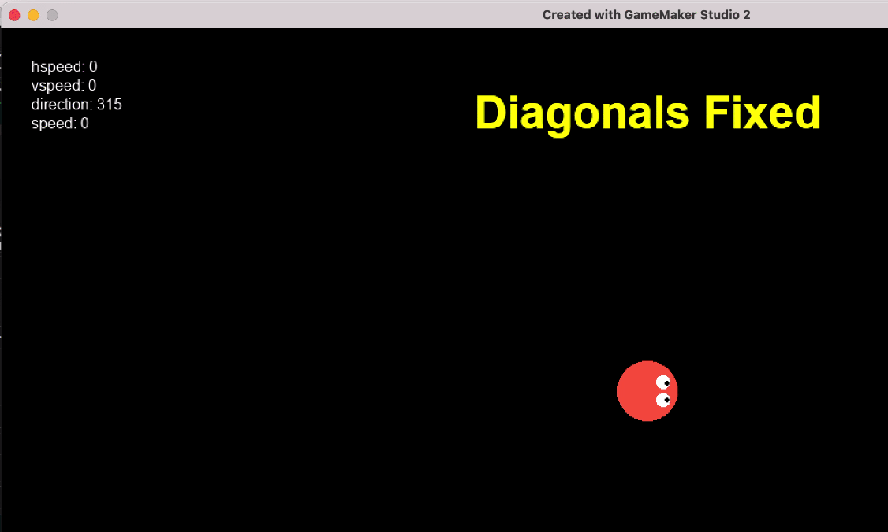

##### `Step 10.`\|`MI8D`| :large_blue_diamond:

When we see a decimal point on what we expect is a whole number, there is a concern. This means there is most likely a fractional residue and we are not getting 180 without a decimal left over.  So if we use the **[string_forma(val, tot, dec)]()**.

> Turns a real number into a string using your own formatting, where you can choose how many "places" are saved to the string and how many decimal places are saved also. Both can be very handy, some games prefer to display a score as a set number of digits, while control over decimal places can be good for a high accuracy the two decimal places of string() cannot provide. If the number of places specified is greater than the value to be shown and/or the number plus the decimal places that have been specified is less than the total places, then spaces will be added before the value to make up the difference (see the example below). Zeros will be added to the right of the decimal point if the value given is less than the total and the number of decimal places to include. - GameMaker Manual

Lets use this funciton to see what value we have left over in the fractional part of this angle we are trying to read.

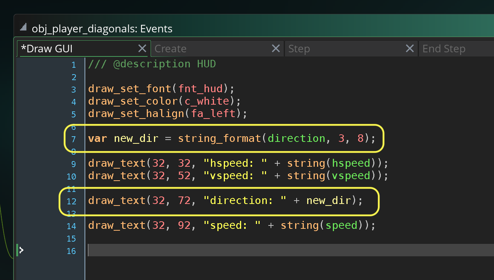

##### `Step 11.`\|`MI8D`| :large_blue_diamond: :small_blue_diamond: 

Now *press* the <kbd>Play</kbd> button in the top menu bar to launch the game. Now press the <kbd>Space Bar</kbd> and go to the diagonals room. Notice for 180 we are getting 180.00001526.  This means that when we pick an animation to match 180 we will need to compare it to 180.0001526 to get a match (for that `direction == 180.00001526` to be true).

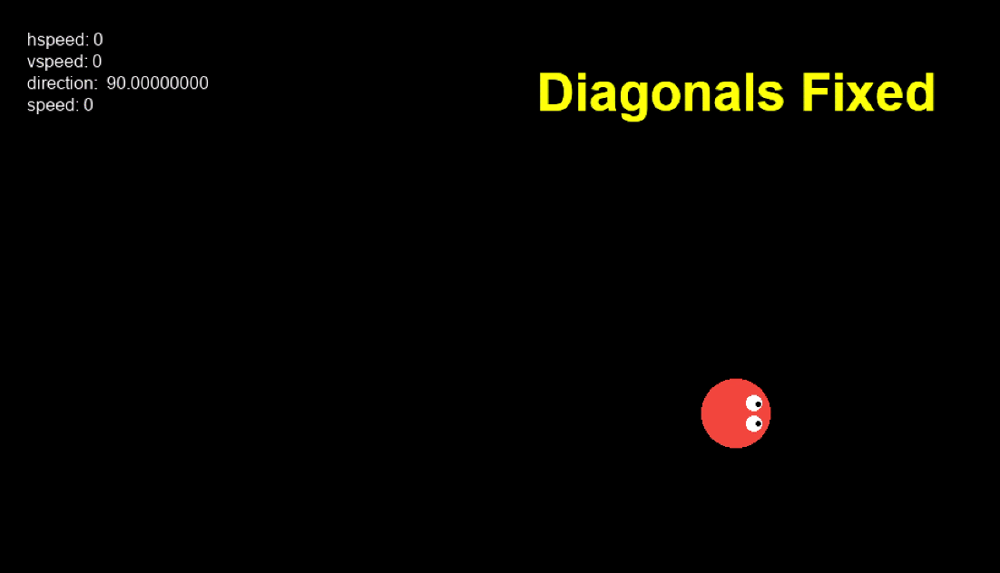

##### `Step 12.`\|`MI8D`| :large_blue_diamond: :small_blue_diamond: :small_blue_diamond: 

So since there are some precision errors that can creap in with floats, we really only want a whole number.  So we can truncate everything after the decimal by using a **[floor(num)](https://manual.yoyogames.com/GameMaker_Language/GML_Reference/Maths_And_Numbers/Number_Functions/floor.htm)**.

> Returns the floor of n, that is, n rounded down to an integer. This is similar to the round() function, but it only rounds down, no matter what the decimal value, so floor(5.99999) will return 5, as will floor(5.2), floor(5.6457). - GameMaker Manual

So we will open up **obj_player_diagonals | step** and add floor the result of finding angle theta.

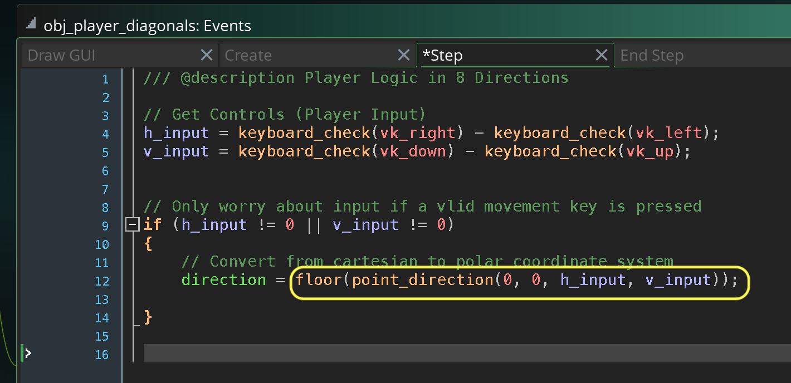

##### `Step 13.`\|`MI8D`| :large_blue_diamond: :small_blue_diamond: :small_blue_diamond:  :small_blue_diamond: 

##### `Step 14.`\|`MI8D`| :large_blue_diamond: :small_blue_diamond: :small_blue_diamond: :small_blue_diamond:  :small_blue_diamond: 

##### `Step 15.`\|`MI8D`| :large_blue_diamond: :small_orange_diamond: 

##### `Step 16.`\|`MI8D`| :large_blue_diamond: :small_orange_diamond:   :small_blue_diamond: 

##### `Step 17.`\|`MI8D`| :large_blue_diamond: :small_orange_diamond: :small_blue_diamond: :small_blue_diamond:

##### `Step 18.`\|`MI8D`| :large_blue_diamond: :small_orange_diamond: :small_blue_diamond: :small_blue_diamond: :small_blue_diamond:

##### `Step 19.`\|`MI8D`| :large_blue_diamond: :small_orange_diamond: :small_blue_diamond: :small_blue_diamond: :small_blue_diamond: :small_blue_diamond:

##### `Step 20.`\|`MI8D`| :large_blue_diamond: :large_blue_diamond:

##### `Step 21.`\|`MI8D`| :large_blue_diamond: :large_blue_diamond: :small_blue_diamond:

___

| [previous](../simple-8dir/README.md#user-content-simple-movement-8-directions)| [home](../README.md#user-content-gms2-move-in-8-directions) | [next](../)|
|---|---|---|
