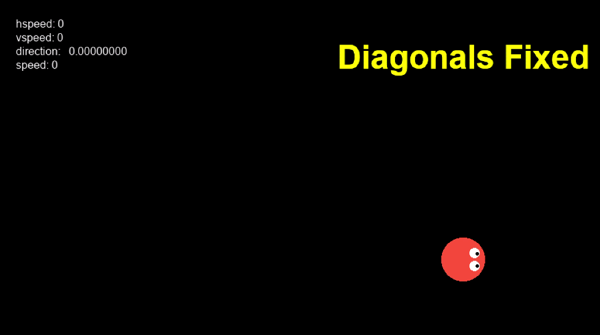
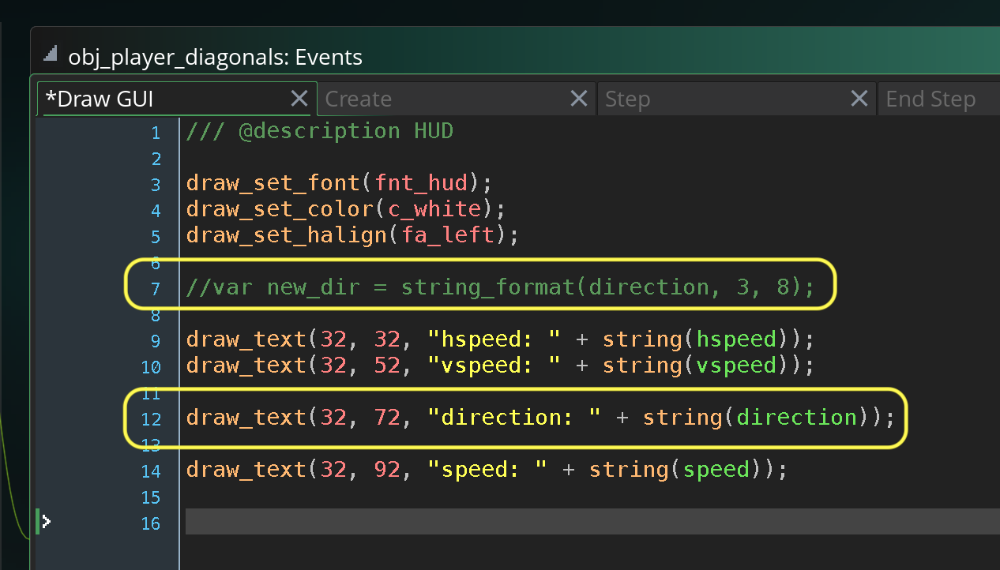
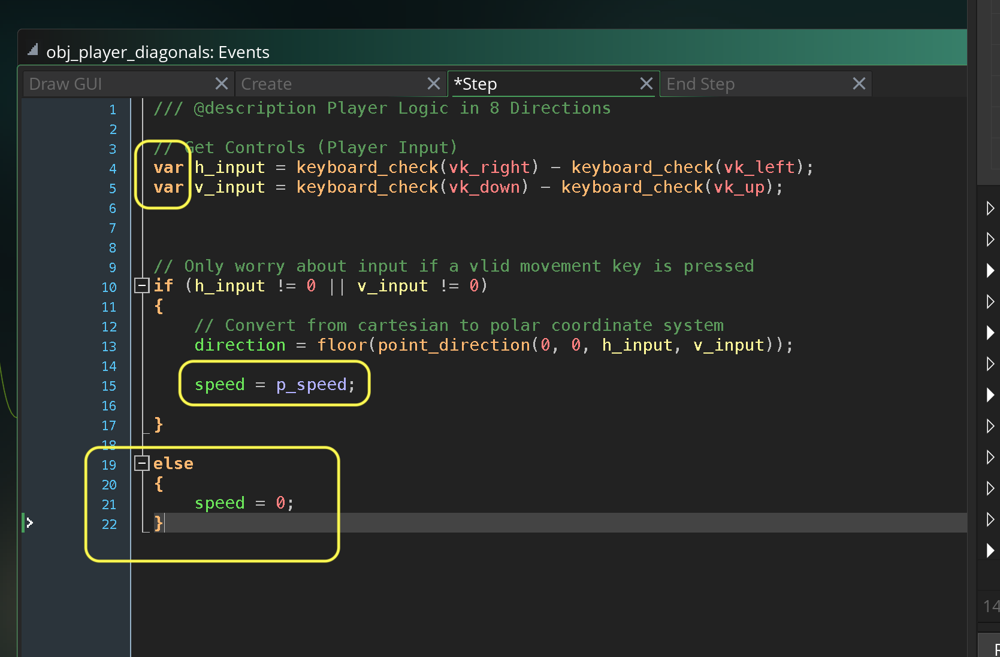
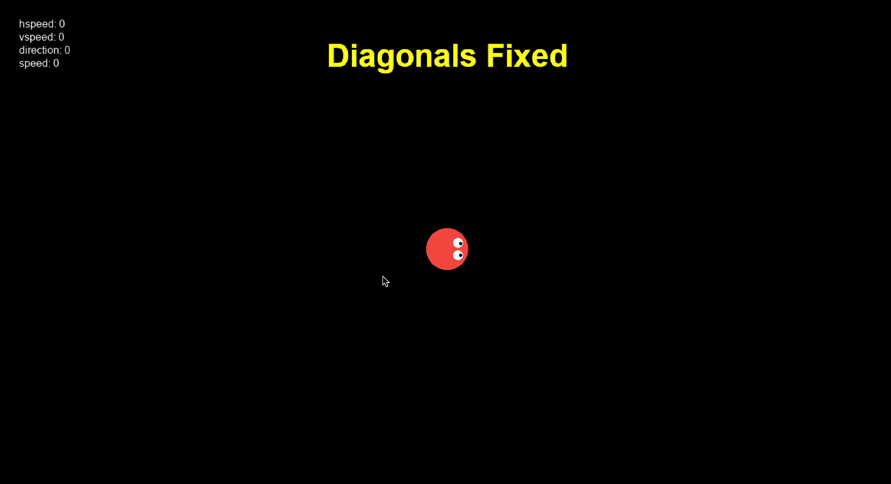
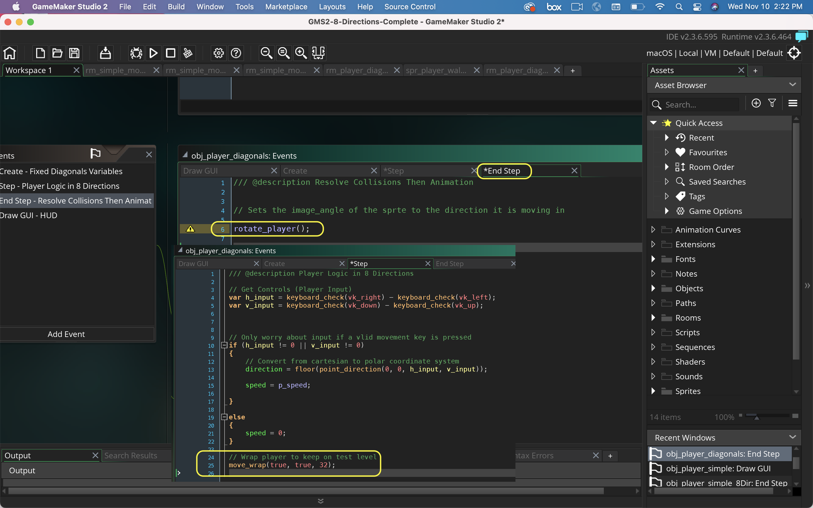
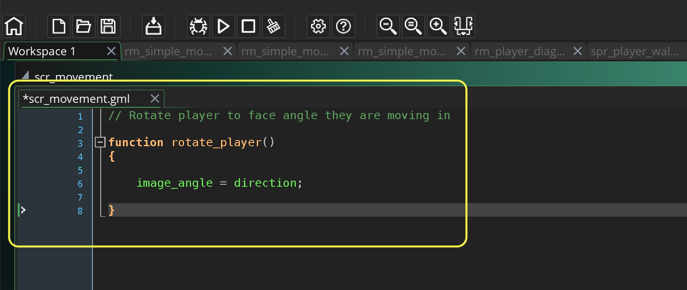
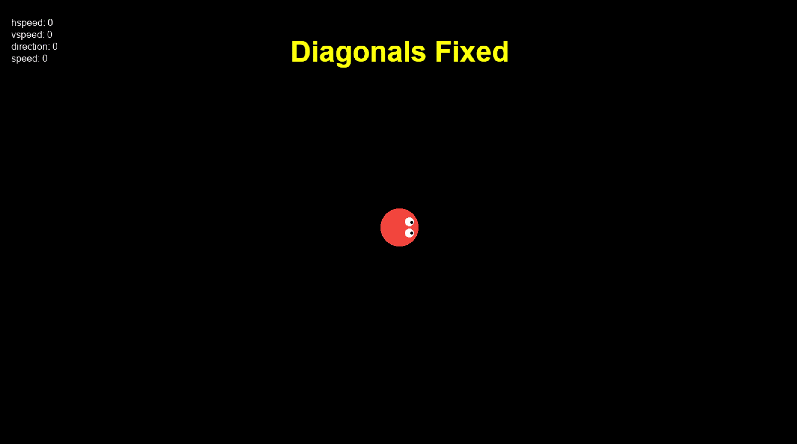

### Diagonal Speed Fix

[previous](../simple-8dir/README.md#user-content-simple-movement-8-directions) • [home](../README.md#user-content-gms2-move-in-8-directions) • [next](../)

Now if we are moving at the same magnitude on the horizontal and vertical axis then our speed ends up being 1.414 times faster than in an orthoganal direction.  We can figure this out by applying Pythagorean theorem.  The magnitude will be the square root of (horizontal squared + vertical squared). so the square root of 12 + 12  is 1.414. Lets instead use direction and calculate an angle then give it the same magnitude regardless of the key combination.

 

---

##### `Step 1.`\|`MI8D`|:small_blue_diamond:

*Right click* on **Sprites** and select **New | Sprite** and name it `spr_player_2`. Press the <kbd>Edit Image</kbd> button and draw a top down view of a sprite.  Make it a different color from the first one.  Set the **Origin** to `Middle Center`.

##### `Step 2.`\|`FHIU`|:small_blue_diamond: :small_blue_diamond: 

*Right click* on **Objects** and select **New | Object** and name it `obj_player_diagonals`. Set the **Sprite** to `spr_player_2`.

##### `Step 3.`\|`MI8D`|:small_blue_diamond: :small_blue_diamond: :small_blue_diamond:

*Right click* on **Rooms** and select **New | Room** and name it `rm_player_diagonals`. Drag a **obj_player_diagonals** into the new room.

##### `Step 4.`\|`MI8D`|:small_blue_diamond: :small_blue_diamond: :small_blue_diamond: :small_blue_diamond:

*Double click* on **obj_game | Draw GUI** event and add a title for the Diagonals room.

##### `Step 5.`\|`MI8D`| :small_orange_diamond:

Press the <kbd>Add Event</kbd> and select a **Draw | Draw GUI** event. Now lets draw a hud:

1. Select **fnt_hud**
2. Set color to white
3. Left aligh the text
4. Draw a HUD in the top left corner with **hspeed**, **vspeed**, **direction** and **speed**

##### `Step 6.`\|`MI8D`| :small_orange_diamond: :small_blue_diamond:

Now *press* the <kbd>Play</kbd> button in the top menu bar to launch the game. Now press the <kbd>Space Bar</kbd> and go to the diagonals room.  All we should have is the player with a title and a HUD and the player does nothing.

##### `Step 7.`\|`MI8D`| :small_orange_diamond: :small_blue_diamond: :small_blue_diamond:

Open up **obj_player** and press the <kbd>Add Event</kbd> button and add a **Step | Step** event.  Now we will look at **[keyboard_check(key)](https://manual.yoyogames.com/GameMaker_Language/GML_Reference/Game_Input/Keyboard_Input/keyboard_check.htm)** and will subtract the left key from the right key.  Now `keyboard_check(key)` returns a boolean which will be 1 if true and 0 if false.  This means if *right* is pressed it will be *1-0*. If *left* is pressed it will be *0-1*.  If both right and left are pressed it will be 1-1.  So this gives us a range of -1 to 1.

Now what we are going to do is get a direction in degrees based on these two axis.  We are going to convert from cartesian to the polar coordinate system.  So lets look at a controller.  The axis center is (0,0) on the x,y axis.  The end of the vector will be for example (1, -1) on the x,y axis.  This means the player is moving top right or 45°.

##### `Step 8.`\|`MI8D`| :small_orange_diamond: :small_blue_diamond: :small_blue_diamond: :small_blue_diamond:

To make the above angle conversion we will use **[point_direction(x1, y1, x2, y2)](https://docs.yoyogames.com/source/dadiospice/002_reference/maths/vector%20functions/point_direction.html)** and this function will return the angle in degrees. We will feed this value to the **direction** variable to affect the direction the player is moving in.

##### `Step 9.`\|`MI8D`| :small_orange_diamond: :small_blue_diamond: :small_blue_diamond: :small_blue_diamond: :small_blue_diamond:

Now *press* the <kbd>Play</kbd> button in the top menu bar to launch the game. Now press the <kbd>Space Bar</kbd> and go to the diagonals room. Now press the arrow keys and look at the result.  Notice that on my computer I am getting a value when I press the <kbd>Left Button</kbd> of `180.00`. 

##### `Step 10.`\|`MI8D`| :large_blue_diamond:

When we see a decimal point on what we expect is a whole number, there is a concern. This means there is most likely a fractional residue and we are not getting 180 without a decimal left over.  So if we use the **[string_forma(val, tot, dec)]()**.

> Turns a real number into a string using your own formatting, where you can choose how many "places" are saved to the string and how many decimal places are saved also. Both can be very handy, some games prefer to display a score as a set number of digits, while control over decimal places can be good for a high accuracy the two decimal places of string() cannot provide. If the number of places specified is greater than the value to be shown and/or the number plus the decimal places that have been specified is less than the total places, then spaces will be added before the value to make up the difference (see the example below). Zeros will be added to the right of the decimal point if the value given is less than the total and the number of decimal places to include. - GameMaker Manual

Lets use this funciton to see what value we have left over in the fractional part of this angle we are trying to read.

##### `Step 11.`\|`MI8D`| :large_blue_diamond: :small_blue_diamond: 

Now *press* the <kbd>Play</kbd> button in the top menu bar to launch the game. Now press the <kbd>Space Bar</kbd> and go to the diagonals room. Notice for 180 we are getting 180.00001526.  This means that when we pick an animation to match 180 we will need to compare it to 180.0001526 to get a match (for that `direction == 180.00001526` to be true).

##### `Step 12.`\|`MI8D`| :large_blue_diamond: :small_blue_diamond: :small_blue_diamond: 

So since there are some precision errors that can creap in with floats, we really only want a whole number.  So we can truncate everything after the decimal by using a **[floor(num)](https://manual.yoyogames.com/GameMaker_Language/GML_Reference/Maths_And_Numbers/Number_Functions/floor.htm)**.

> Returns the floor of n, that is, n rounded down to an integer. This is similar to the round() function, but it only rounds down, no matter what the decimal value, so floor(5.99999) will return 5, as will floor(5.2), floor(5.6457). - GameMaker Manual

So we will open up **obj_player_diagonals | step** and add floor the result of finding angle theta.

##### `Step 13.`\|`MI8D`| :large_blue_diamond: :small_blue_diamond: :small_blue_diamond:  :small_blue_diamond: 

Now *press* the <kbd>Play</kbd> button in the top menu bar to launch the game. Now press the <kbd>Space Bar</kbd> and go to the diagonals room. Notice that all numbers have no fractional remainder.  So we have solved a future problem when we will have to select the animation based on the angle.

##### `Step 14.`\|`MI8D`| :large_blue_diamond: :small_blue_diamond: :small_blue_diamond: :small_blue_diamond:  :small_blue_diamond: 

Now we can return the hud back to printing the directions normally.  Open up **obj_player_diagonals** and select the **Draw GUI** event.  Remove or comment out the string formatting and return to printing **direction** to the hud directly.

##### `Step 15.`\|`MI8D`| :large_blue_diamond: :small_orange_diamond: 

Now lets center the player and add movement.  Press the <kbd>Add Event</kbd> and select a **Create** event. We need to add a variable called `p_speed` that will hold the speed of the player based on pixel displacement per tick (frame).  Remember that **GameMaker** defaults to 60 frames per second, the step event runs 60 times every second.

##### `Step 16.`\|`MI8D`| :large_blue_diamond: :small_orange_diamond:   :small_blue_diamond: 

Now lets open up **obj_player | Step** event and add a **[var](https://manual.yoyogames.com/GameMaker_Language/GML_Overview/Variables/Local_Variables.htm)** in front of our two axis for player input.  

> A local variable is one that we create for a specific event or function only and then discard when the event or function has finished. Why would we need them? Well, variables take up space in memory and it may be that we are only going to use them for one operation or function in which case we only need to have it in memory for that short time that it's used. This keeps your code base clean and tidy as well as keeping memory space optimised for the things that really need it.  - GameMaker manual

We do not need to keep the two axis variablbes in memory all the time as it is only needed by the **step** event.  So putting `var` in front of it makes it a local variable and is not accessible outside this event.

We will also make our speed consistent across axis by just setting our `speed` to `p_speed`.  WE make sure that we `0` it out when the player is **not** moving.

##### `Step 17.`\|`MI8D`| :large_blue_diamond: :small_orange_diamond: :small_blue_diamond: :small_blue_diamond:

Now *press* the <kbd>Play</kbd> button in the top menu bar to launch the game. Now press the <kbd>Space Bar</kbd> and go to the diagonals room. Now you will notice that the player is only updating when they are moving and that the **speed** is the same in all axis and we no longer have the player moving faster running in diagonals.

##### `Step 18.`\|`MI8D`| :large_blue_diamond: :small_orange_diamond: :small_blue_diamond: :small_blue_diamond: :small_blue_diamond:

Now we want to add a **move_wrap()** to the **step** event so that the player does not leave the screen.  This is not necessary if you have a level that the player cannot move outside the edge of the level.

Now we want to also update the animation.  We are better off doing this after the player has moved as we would have to resolve collisions before we know what state a player ends up in. Now the player moves between the **step** and **end step** events. Press the <kbd>Add Event</kbd> and select a **Step | End Step** event. Call a function we will define called rotate_player();

##### `Step 19.`\|`MI8D`| :large_blue_diamond: :small_orange_diamond: :small_blue_diamond: :small_blue_diamond: :small_blue_diamond: :small_blue_diamond:

*Right click* on **Scripts** and select **Create | Script** and name it `scr_movement`. Rename the function to `rotate_player()` and set the `image_angle` to the `direction` the player is pointing in.

##### `Step 20.`\|`MI8D`| :large_blue_diamond: :large_blue_diamond:

Now *press* the <kbd>Play</kbd> button in the top menu bar to launch the game. Now press the <kbd>Space Bar</kbd> and go to the diagonals room. Now when you go off the edge you come back on the other side.  The player also faces the correct direction and does not face right when you let go.  We have a much more robust implementation than the simple one we did previously.

##### `Step 21.`\|`MI8D`| :large_blue_diamond: :large_blue_diamond: :small_blue_diamond:

Select the **File | Save Project** then press **File | Quit** to make sure everything in the game is saved. If you are using **GitHub** open up **GitHub Desktop** and add a title and longer description (if necessary) and press the <kbd>Commit to main</kbd> button. Finish by pressing **Push origin** to update the server with the latest changes.

___

| [previous](../simple-8dir/README.md#user-content-simple-movement-8-directions)| [home](../README.md#user-content-gms2-move-in-8-directions) | [next](../)|
|---|---|---|
