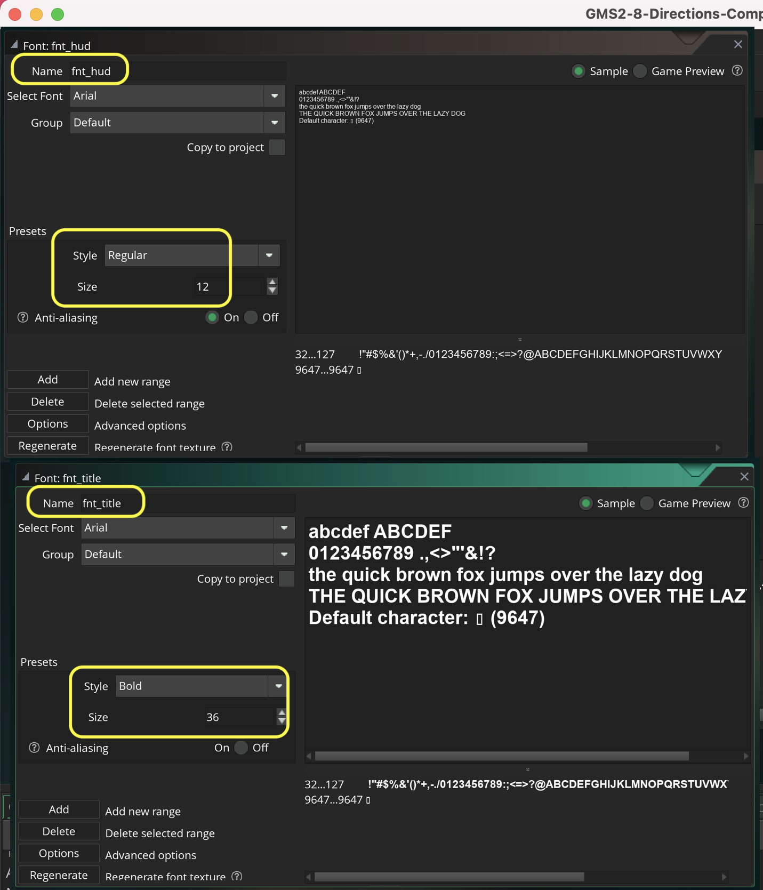

### Fix Diagonal Speed

[previous](../simple-movement/README.md#user-content-simple-movement-in-8-directions) • [home](../README.md#user-content-gms2-move-in-8-directions) • [next](../)

Now if we are moving at the same magnitude on the horizontal and vertical axis then our speed ends up being 1.414 times faster than in an orthoganal direction.  We can figure this out by applying Pythagorean theorem.  The magnitude will be the square root of (horizontal squared + vertical squared). so the square root of 12 + 12  is 1.414. Lets instead use direction and calculate an angle then give it the same magnitude regardless of the key combination.

 

---

##### `Step 1.`\|`MI8D`|:small_blue_diamond:

Create two fonts by right clicking on **Fonts** and select **Create | Font**.  Name one `fnt_title` and the other `fnt_hud`. Make the **fnt_hud** a **Size** of `12` and **Style** set to `Regular`.Make the **fnt_title** a **Size** of `36` and **Style** set to `bold`.  

##### `Step 2.`\|`FHIU`|:small_blue_diamond: :small_blue_diamond: 

##### `Step 3.`\|`MI8D`|:small_blue_diamond: :small_blue_diamond: :small_blue_diamond:

##### `Step 4.`\|`MI8D`|:small_blue_diamond: :small_blue_diamond: :small_blue_diamond: :small_blue_diamond:

##### `Step 5.`\|`MI8D`| :small_orange_diamond:

##### `Step 6.`\|`MI8D`| :small_orange_diamond: :small_blue_diamond:

##### `Step 7.`\|`MI8D`| :small_orange_diamond: :small_blue_diamond: :small_blue_diamond:

##### `Step 8.`\|`MI8D`| :small_orange_diamond: :small_blue_diamond: :small_blue_diamond: :small_blue_diamond:

##### `Step 9.`\|`MI8D`| :small_orange_diamond: :small_blue_diamond: :small_blue_diamond: :small_blue_diamond: :small_blue_diamond:

##### `Step 10.`\|`MI8D`| :large_blue_diamond:

##### `Step 11.`\|`MI8D`| :large_blue_diamond: :small_blue_diamond: 

##### `Step 12.`\|`MI8D`| :large_blue_diamond: :small_blue_diamond: :small_blue_diamond: 

##### `Step 13.`\|`MI8D`| :large_blue_diamond: :small_blue_diamond: :small_blue_diamond:  :small_blue_diamond: 

##### `Step 14.`\|`MI8D`| :large_blue_diamond: :small_blue_diamond: :small_blue_diamond: :small_blue_diamond:  :small_blue_diamond: 

##### `Step 15.`\|`MI8D`| :large_blue_diamond: :small_orange_diamond: 

##### `Step 16.`\|`MI8D`| :large_blue_diamond: :small_orange_diamond:   :small_blue_diamond: 

##### `Step 17.`\|`MI8D`| :large_blue_diamond: :small_orange_diamond: :small_blue_diamond: :small_blue_diamond:

##### `Step 18.`\|`MI8D`| :large_blue_diamond: :small_orange_diamond: :small_blue_diamond: :small_blue_diamond: :small_blue_diamond:

##### `Step 19.`\|`MI8D`| :large_blue_diamond: :small_orange_diamond: :small_blue_diamond: :small_blue_diamond: :small_blue_diamond: :small_blue_diamond:

##### `Step 20.`\|`MI8D`| :large_blue_diamond: :large_blue_diamond:

##### `Step 21.`\|`MI8D`| :large_blue_diamond: :large_blue_diamond: :small_blue_diamond:

___

| [previous](../simple-movement/README.md#user-content-simple-movement-in-8-directions)| [home](../README.md#user-content-gms2-move-in-8-directions) | [next](../)|
|---|---|---|
