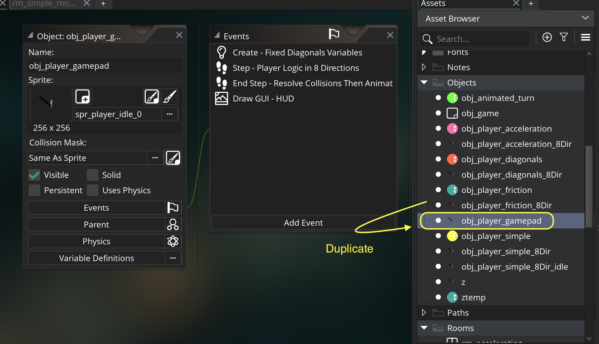

### Gamepad

[previous](../) • [home](../README.md#user-content-gms2-move-in-8-directions)

Now lets look at how we would implement similar controls on a gamepad. We will get more angles than the 8 we get from the keyboard.  We will allow the player to move slower and faster and at all angles, but will only select the closest of the 8 animation directions.

 

---

##### `Step 1.`\|`MI8D`|:small_blue_diamond:

Duplicate **obj_player_friction_8Dir** and call it `obj_player_gamepad`. 

##### `Step 2.`\|`FHIU`|:small_blue_diamond: :small_blue_diamond: 

*Right click* on **Rooms** and select **New | Room** and name it `rm_player_gamepad`. *Drag and drop* **obj_player_gamepad** into the room.

##### `Step 3.`\|`MI8D`|:small_blue_diamond: :small_blue_diamond: :small_blue_diamond:

Open up **obj_game | Draw GUI** and add a title for the gamepad room.

##### `Step 4.`\|`MI8D`|:small_blue_diamond: :small_blue_diamond: :small_blue_diamond: :small_blue_diamond:

##### `Step 5.`\|`MI8D`| :small_orange_diamond:

##### `Step 6.`\|`MI8D`| :small_orange_diamond: :small_blue_diamond:

##### `Step 7.`\|`MI8D`| :small_orange_diamond: :small_blue_diamond: :small_blue_diamond:

##### `Step 8.`\|`MI8D`| :small_orange_diamond: :small_blue_diamond: :small_blue_diamond: :small_blue_diamond:

##### `Step 9.`\|`MI8D`| :small_orange_diamond: :small_blue_diamond: :small_blue_diamond: :small_blue_diamond: :small_blue_diamond:

##### `Step 10.`\|`MI8D`| :large_blue_diamond:

##### `Step 11.`\|`MI8D`| :large_blue_diamond: :small_blue_diamond: 

##### `Step 12.`\|`MI8D`| :large_blue_diamond: :small_blue_diamond: :small_blue_diamond: 

##### `Step 13.`\|`MI8D`| :large_blue_diamond: :small_blue_diamond: :small_blue_diamond:  :small_blue_diamond: 

##### `Step 14.`\|`MI8D`| :large_blue_diamond: :small_blue_diamond: :small_blue_diamond: :small_blue_diamond:  :small_blue_diamond: 

##### `Step 15.`\|`MI8D`| :large_blue_diamond: :small_orange_diamond: 

##### `Step 16.`\|`MI8D`| :large_blue_diamond: :small_orange_diamond:   :small_blue_diamond: 

##### `Step 17.`\|`MI8D`| :large_blue_diamond: :small_orange_diamond: :small_blue_diamond: :small_blue_diamond:

##### `Step 18.`\|`MI8D`| :large_blue_diamond: :small_orange_diamond: :small_blue_diamond: :small_blue_diamond: :small_blue_diamond:

##### `Step 19.`\|`MI8D`| :large_blue_diamond: :small_orange_diamond: :small_blue_diamond: :small_blue_diamond: :small_blue_diamond: :small_blue_diamond:

##### `Step 20.`\|`MI8D`| :large_blue_diamond: :large_blue_diamond:

##### `Step 21.`\|`MI8D`| :large_blue_diamond: :large_blue_diamond: :small_blue_diamond:

___

| [previous](../animated-turn/README.md#user-content-animated-turn)| [home](../README.md#user-content-gms2-move-in-8-directions) |
|---|---|
