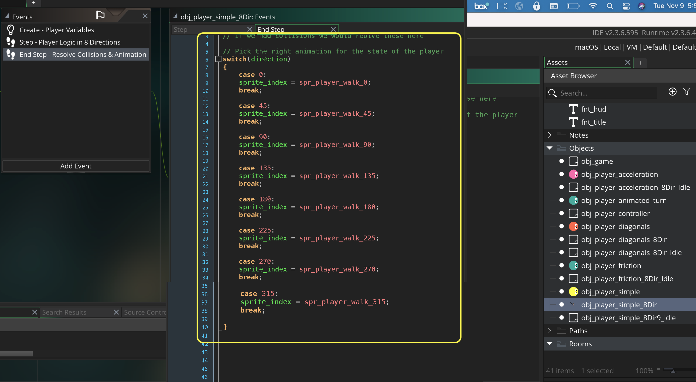
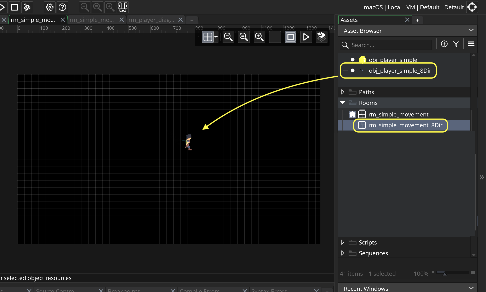

### Simple Movement 8 Directions

[previous](../simple-movement/README.md#user-content-simple-movement-in-8-directions) • [home](../README.md#user-content-gms2-move-in-8-directions) • [next](../)

Now lets use an animation that can move in eight directions. This way we can switch animations instead of rotating a top down sprite.

 

---

##### `Step 1.`\|`MI8D`|:small_blue_diamond:

Create two fonts by right clicking on **Fonts** and select **Create | Font**.  Name one `fnt_title` and the other `fnt_hud`. Make the **fnt_hud** a **Size** of `12` and **Style** set to `Regular`. Make the **fnt_title** a **Size** of `36` and **Style** set to `Bold`.  

##### `Step 2.`\|`FHIU`|:small_blue_diamond: :small_blue_diamond: 

Now lets show that the speed is different in diagonals.  Open up **obj_player_simple** and press the <kbd>Add Event</kbd> button and select a **Draw | Draw GUI** event.

* Select the font
* Align the font to the left
* Set the color to white
* Draw **speed**, **direction**, **hspeed** and **vspeed** to screen

##### `Step 3.`\|`MI8D`|:small_blue_diamond: :small_blue_diamond: :small_blue_diamond:

Now *press* the <kbd>Play</kbd> button in the top menu bar to launch the game. Now when you play the first level you notice the speed is **3.54** when running in diagonals and we want it to be limited to **2.5** as a maximum speed.

##### `Step 4.`\|`MI8D`|:small_blue_diamond: :small_blue_diamond: :small_blue_diamond: :small_blue_diamond:

*Right click* on **Objects** and select **New | Object** and name it `obj_game`. Set the **Persistent** to `true` so this object will go from room to room as we add more levels.

##### `Step 5.`\|`MI8D`| :small_orange_diamond:

Press the <kbd>Add Event</kbd> and select a **Draw | Draw GUI** event.

* Set the color to yellow
* Center the text alignment
* Pick the **fnt_title** font
* Add a variable **title**
* Switch on the room to have different titles in different rooms
* Draw text to top center of screen

##### `Step 6.`\|`MI8D`| :small_orange_diamond: :small_blue_diamond:

Open up **rm_simple_movement** and add an instance of **obj_game** on to the **Instances** layer in the room.

##### `Step 7.`\|`MI8D`| :small_orange_diamond: :small_blue_diamond: :small_blue_diamond:

Now *press* the <kbd>Play</kbd> button in the top menu bar to launch the game. Notice that we have a title for the room!

##### `Step 8.`\|`MI8D`| :small_orange_diamond: :small_blue_diamond: :small_blue_diamond: :small_blue_diamond:

Download [8DirectionTopDownMovement.yymps](../Assets/8DirectionTopDownMovement.yymps). This is a resized sprite provided by [RGS Dev on itch.io](https://rgsdev.itch.io/animated-top-down-character-base-template-in-pixel-art-rgsdev). Select the **Tools | Import Local Package** menu item.  Open the file you just downloaded above.

##### `Step 9.`\|`MI8D`| :small_orange_diamond: :small_blue_diamond: :small_blue_diamond: :small_blue_diamond: :small_blue_diamond:

Select the folder and press the <kbd>Add All</kbd> button.  Make sure you are downloading 8 walk and 8 idle animations.  Press the <kbd>Import</kbd> button to bring them into your project.

##### `Step 10.`\|`MI8D`| :large_blue_diamond:

Now if you press the play button on the sprites you will see that we have 8 directions of walking and idle animations.

##### `Step 11.`\|`MI8D`| :large_blue_diamond: :small_blue_diamond: 

Right click on **obj_player_simple** and select **Duplicate**.  Name the new sprite `obj_player_simple_8Dir`. Assign `spr_player_walk_0` to the **Sprite:**  in the game object.

##### `Step 12.`\|`MI8D`| :large_blue_diamond: :small_blue_diamond: :small_blue_diamond: 

Open up the **obj_player_simple_8Dir | Step** event and comment out or delete 

##### `Step 13.`\|`MI8D`| :large_blue_diamond: :small_blue_diamond: :small_blue_diamond:  :small_blue_diamond: 

Now we normally:

1. Get Controls
2. Update player phyics 
3. Move and rotate player based on above physics (resolve physics if using speed/hspeed/vspeed automatically happens between step and end step events)
4. Resolve collision -> Decide on final state (walking, running, stopped etc...)
5. Select Animation

So in the **Step** event we get the controls, update the player physics.  But the player does not move at that point when using `speed`, `hspeed` or `vspeed`.  The position will change between the **Step** and the **End Step** event.  This means that to resolve collisions, we only know if an object is colliding in the **End Step**.  

So press the <kbd>Add Event</kbd> button and select a **Step | End Step** event. Then we **switch** on the **Direction** the player is moving in and select the appropriate sprite.

##### `Step 14.`\|`MI8D`| :large_blue_diamond: :small_blue_diamond: :small_blue_diamond: :small_blue_diamond:  :small_blue_diamond: 

*Right click* on **Rooms** and select **New | Room** and name it `rm_simple_movement_8Dir`. Drag and drop **obj_player_simple_8Dir** to level.

##### `Step 15.`\|`MI8D`| :large_blue_diamond: :small_orange_diamond: 

##### `Step 16.`\|`MI8D`| :large_blue_diamond: :small_orange_diamond:   :small_blue_diamond: 

##### `Step 17.`\|`MI8D`| :large_blue_diamond: :small_orange_diamond: :small_blue_diamond: :small_blue_diamond:

##### `Step 18.`\|`MI8D`| :large_blue_diamond: :small_orange_diamond: :small_blue_diamond: :small_blue_diamond: :small_blue_diamond:

##### `Step 19.`\|`MI8D`| :large_blue_diamond: :small_orange_diamond: :small_blue_diamond: :small_blue_diamond: :small_blue_diamond: :small_blue_diamond:

##### `Step 20.`\|`MI8D`| :large_blue_diamond: :large_blue_diamond:

##### `Step 21.`\|`MI8D`| :large_blue_diamond: :large_blue_diamond: :small_blue_diamond:

___

| [previous](../simple-movement/README.md#user-content-simple-movement-in-8-directions)| [home](../README.md#user-content-gms2-move-in-8-directions) | [next](../)|
|---|---|---|
