### Simple Movement

[home](../README.md#user-content-gms2-move-in-8-directions) • [next](../simple-8dir/README.md#user-content-simple-movement-8-directions)

We will use **[hspeed](https://manual.yoyogames.com/GameMaker_Language/GML_Reference/Asset_Management/Instances/Instance_Variables/hspeed.htm)** and **[vspeed](https://manual.yoyogames.com/GameMaker_Language/GML_Reference/Asset_Management/Instances/Instance_Variables/vspeed.htm)** to move the player around the 2d level.

 

---

##### `Step 1.`\|`MI8D`|:small_blue_diamond:

Create a new level by right clicking on **Rooms** and select **Create | Room** and call it `rm_simple_movement`.  Open up **Room Order** and *drag* it to the top of the list if you have other rooms in your project.

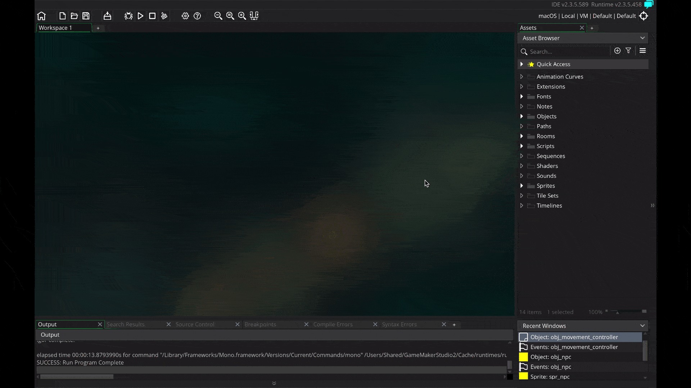

##### `Step 2.`\|`FHIU`|:small_blue_diamond: :small_blue_diamond: 

Now lets create a sprite for our player that we will be moving.  We will create an eyeball so we can see the direction we are moving in. Right click on **Sprites** and select **Create | Sprite** and call it `spr_player`.  Now press the <kbd>Edit Image</kbd> button to go to the editor.  Select the **Circle tool** and the yellow color and draw a round circle to fill the sprite,  Add an eyeball pointing the right (0 degrees) so that we have the player oriented in our starting direction.

##### `Step 3.`\|`MI8D`|:small_blue_diamond: :small_blue_diamond: :small_blue_diamond:

*Right click* on **Objects** and select **Create | Object** and name it `obj_player`.  Assign sprite `spr_player` by pressing **Sprite** and selecting the sprite.

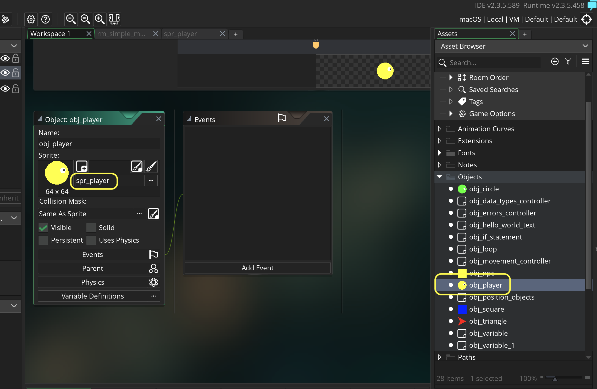

##### `Step 4.`\|`MI8D`|:small_blue_diamond: :small_blue_diamond: :small_blue_diamond: :small_blue_diamond:

Press the <kbd>Add Event</kbd> and add a **Create** and center the object in the dead center of the room.

##### `Step 5.`\|`MI8D`| :small_orange_diamond:

Open up **rm_simple_movement** and drag and drop a **obj_player** into the level. Now *press* the <kbd>Play</kbd> button in the top menu bar to launch the game.

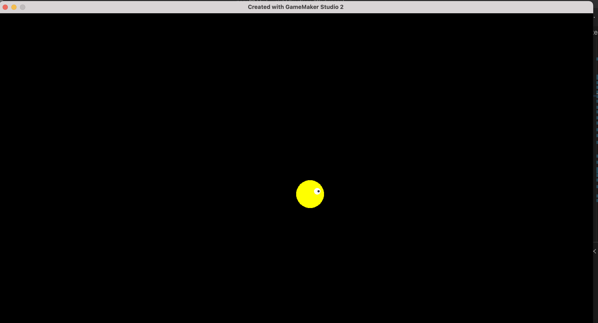

##### `Step 6.`\|`MI8D`| :small_orange_diamond: :small_blue_diamond:

Open up **obj_player** and press the <kbd>Add Event</kbd> button and add a **Step | Step** event.  Now we will look at **[keyboard_check(key)](https://manual.yoyogames.com/GameMaker_Language/GML_Reference/Game_Input/Keyboard_Input/keyboard_check.htm)** and will subtract the left key from the right key.  Now `keyboard_check(key)` returns a boolean which will be 1 if true and 0 if false.  This means if *right* is pressed it will be *1-0*. If *left* is pressed it will be *0-1*.  If both right and left are pressed it will be 1-1.  So this gives us a range of -1 to 1.

Lets prove it.  We will use another new function **[show_debug_message(string)](https://manual.yoyogames.com/GameMaker_Language/GML_Reference/Debugging/show_debug_message.htm)**.  It will print this message in the Debugger Output window. 

##### `Step 7.`\|`MI8D`| :small_orange_diamond: :small_blue_diamond: :small_blue_diamond:

You should have an Output tab in the bottom.  If you don't see it you can select **Window | Output** and it will appear in the bottom section (you might have to expand it to see it better). Now *press* the <kbd>Play</kbd> button in the top menu bar to launch the game and press the <kbd>left</kbd> and <kbd>right</kbd> arrows (and both at the same time) then see the values being printed to reflect the outcome.

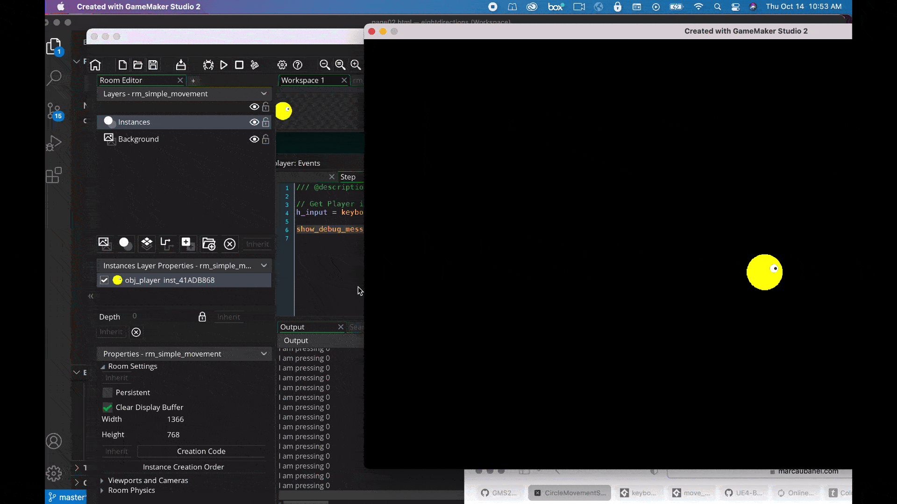

##### `Step 8.`\|`MI8D`| :small_orange_diamond: :small_blue_diamond: :small_blue_diamond: :small_blue_diamond:

Repeat the for moving up and down by looking for the object moving up or down.  Remember positive **y** is moving down so we subtract the up key from the down key.  Lets print to output this result as well.

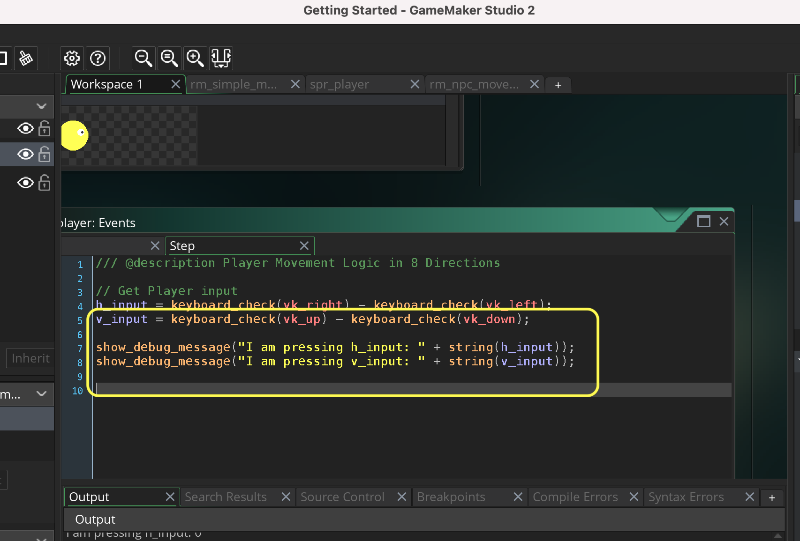

##### `Step 9.`\|`MI8D`| :small_orange_diamond: :small_blue_diamond: :small_blue_diamond: :small_blue_diamond: :small_blue_diamond:

Now *press* the <kbd>Play</kbd> button in the top menu bar to launch the game. Look at the Output Tab and press the left, right, up and down arrow on the keyboard.  The message should print and show either a -1, 0 or 1 for both horizontal or vertical movement. Notice that this only returns a `0`,`1` or `-1` no matter what.  We will use this to multiply how many pixels we move on each axis.

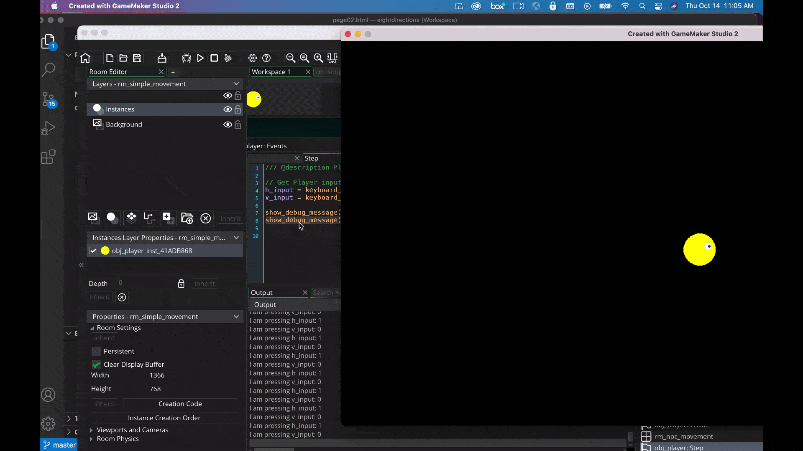

##### `Step 10.`\|`MI8D`| :large_blue_diamond:

Now what is nice about having a range of -1 to 1 is that we can scale it by multiplying it.  If we want to move at a speed of 5 we can multiply this value by 5 and it will range from -5 to 5.  What we will do is set the movement component for each axis.  This is through two variables that comes with every object. **[vspeed](https://manual.yoyogames.com/GameMaker_Language/GML_Reference/Asset_Management/Instances/Instance_Variables/vspeed.htm)** and **[hspeed](https://manual.yoyogames.com/GameMaker_Language/GML_Reference/Asset_Management/Instances/Instance_Variables/hspeed.htm)**.

> hspeed is one of the "built in" properties that all instances have and defines the horizontal movement speed (along the x-axis) of the instance in pixels per step. So, an hspeed of 3 means 3 pixels of movement to the right (+x) every step, and an hspeed of -3 would mean 3 pixels of movement to the left (-x) every step. - GameMake Manual

> vspeed is one of the "built in" properties that all instances have and defines the vertical movement speed (along the y-axis) of the instance in pixels per step. So, a vspeed of 3 means 3 pixels of movement to the bottom (+y) every step, and a vspeed of -3 would mean 3 pixels of movement to the top (-y) every step.

Delete the two `show_debug_message(string)` functions and add to both the `hspeed` and `vspeed` to the object.  Now that will mean when pressing right it will multiply 1 * 2.5 and if you press left it will multiple -1 * 2.5.  So right moves 2.5 pixels per frame and left moves -2.5 pixels per frame.  Same for up and down where up will move -5 pixels up per frame and down will move 2.5 pixels down per frame.

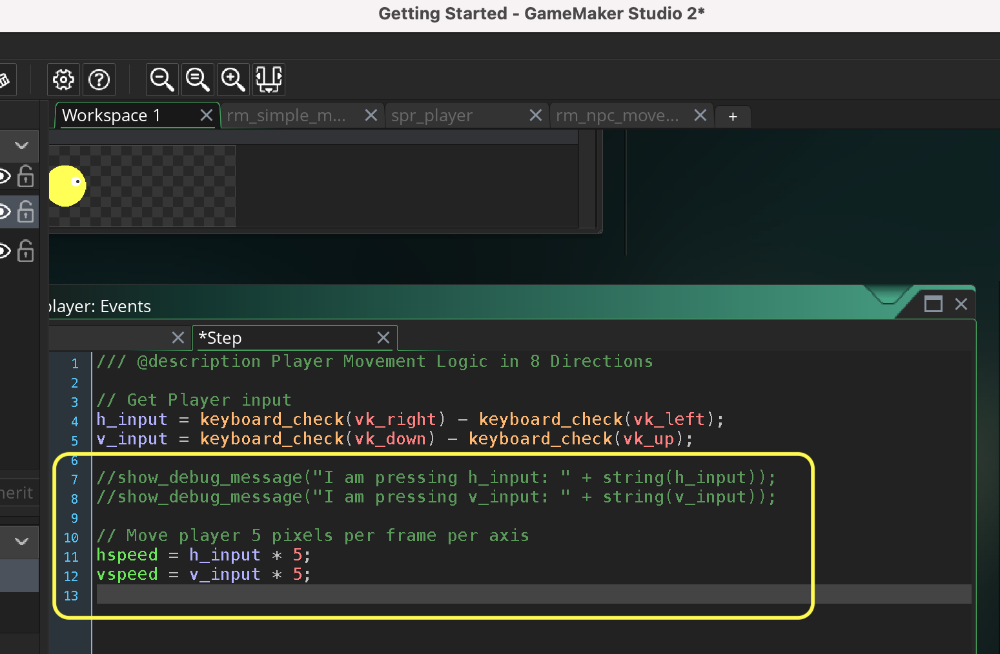

##### `Step 11.`\|`MI8D`| :large_blue_diamond: :small_blue_diamond: 

Now *press* the <kbd>Play</kbd> button in the top menu bar to launch the game. Press the left, right, up and down arrow on the keyboard.  Now the circle moves around the screen.  But woops it can go off screen and disapear.

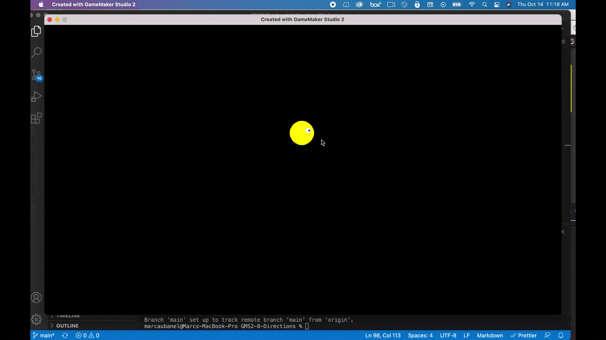

##### `Step 12.`\|`MI8D`| :large_blue_diamond: :small_blue_diamond: :small_blue_diamond: 

Since the entire level is in this one window we can wrap the player when it goes off screen. **GameMaker** has built in functions for a lot of very common game issues and this is one of them: **[move_wrap(hor, vert, margin)](https://manual.yoyogames.com/GameMaker_Language/GML_Reference/Movement_And_Collisions/Movement/move_wrap.htm)**

The **hor** and **vert** are **booleans** so you can set it to wrap either just vertically or horizontally or both.  The margin adjusts so that the sprite has to be offscreen by so many pixels.  In our case it is only completely off screen when half the sprite_get_width(spr_circle) is off screen.  

Add the following to obj_circle_movement: Step event script.

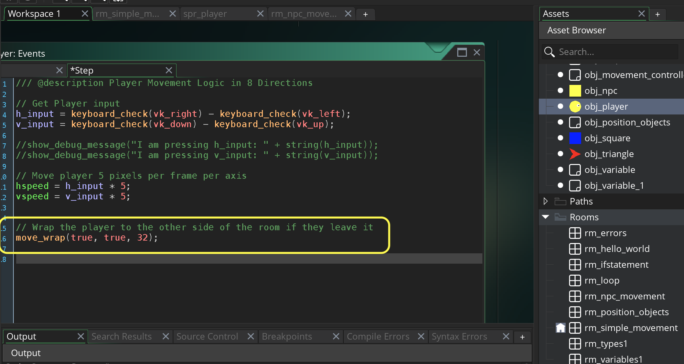

##### `Step 13.`\|`MI8D`| :large_blue_diamond: :small_blue_diamond: :small_blue_diamond:  :small_blue_diamond: 

Now *press* the <kbd>Play</kbd> button in the top menu bar to launch the game. Press the left, right, up and down arrow on the keyboard.  Now go off screen both horizontally and vertically and it reappears on the other side.  Works like a charm and you can never exit the play volume! 

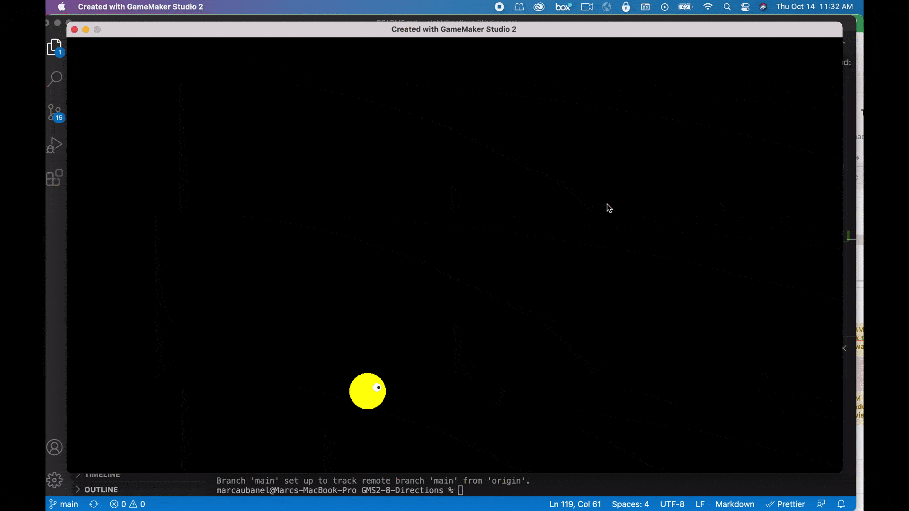

##### `Step 14.`\|`MI8D`| :large_blue_diamond: :small_blue_diamond: :small_blue_diamond: :small_blue_diamond:  :small_blue_diamond: 

Now lets have the player character look at the direction it is moving in.  Now we want the player's **[image_angle](https://manual.yoyogames.com/GameMaker_Language/GML_Reference/Asset_Management/Sprites/Sprite_Instance_Variables/image_angle.htm)** to face the direction the player is moving in.  There is a variable called **[direction](https://manual.yoyogames.com/GameMaker_Language/GML_Reference/Asset_Management/Instances/Instance_Variables/direction.htm)**. that has the angle of the speed of the player (the addition of the hspeed and vspeed).
		
> All instances in GameMaker Studio 2 have certain "built in" properties that you can use and set to govern how they look and behave. Direction is one of those properties and can be used to set the direction of movement of the instance when the instance has a speed other than 0. Note that directions in GameMaker Studio 2 are usually calculated as 0° being right, 90° being up, 180° being left and 270° being down. - GameMaker Manual

Add the following to **obj_player: Step** event script.

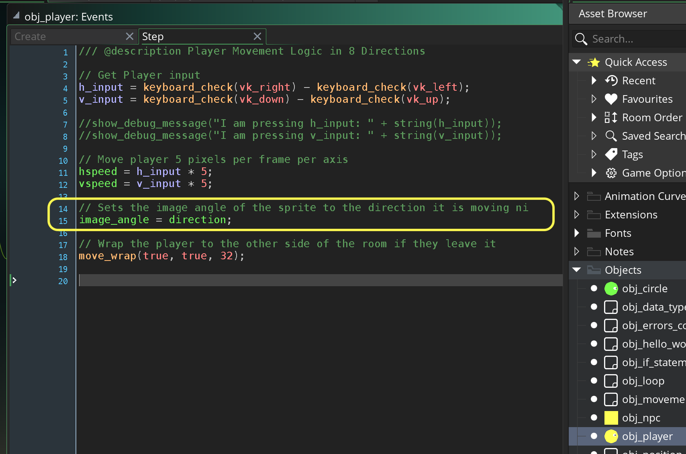

##### `Step 15.`\|`MI8D`| :large_blue_diamond: :small_orange_diamond: 

Now *press* the <kbd>Play</kbd> button in the top menu bar to launch the game. Run the game and notice that the rotation is wrong.  The player is rotating along its origin or the top left corner. This looks really bad when turning.

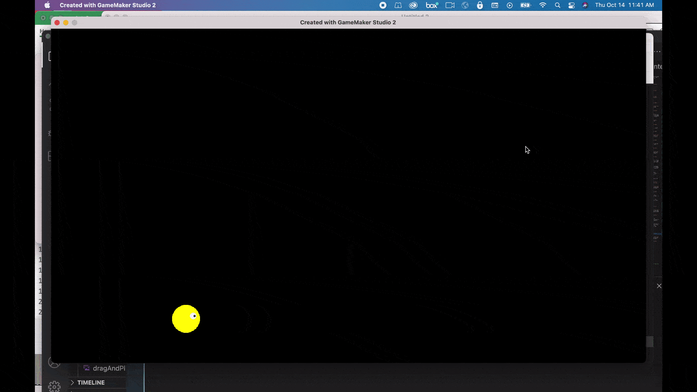

##### `Step 16.`\|`MI8D`| :large_blue_diamond: :small_orange_diamond:   :small_blue_diamond: 

Open up **spr_player** and press the **Origin | Middle Center** option to center the origin.  We want the sprite to rotate in its center of gravity.

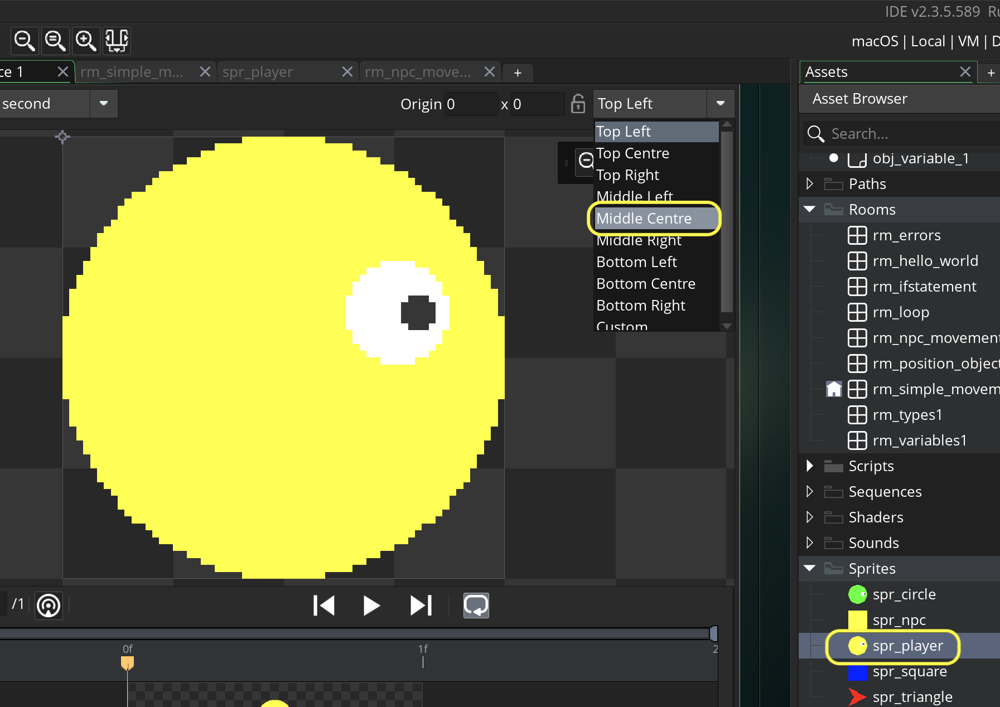

##### `Step 17.`\|`MI8D`| :large_blue_diamond: :small_orange_diamond: :small_blue_diamond: :small_blue_diamond:

Now *press* the <kbd>Play</kbd> button in the top menu bar to launch the game. Now we have the movement working how we like it for a quick and simple implementation.

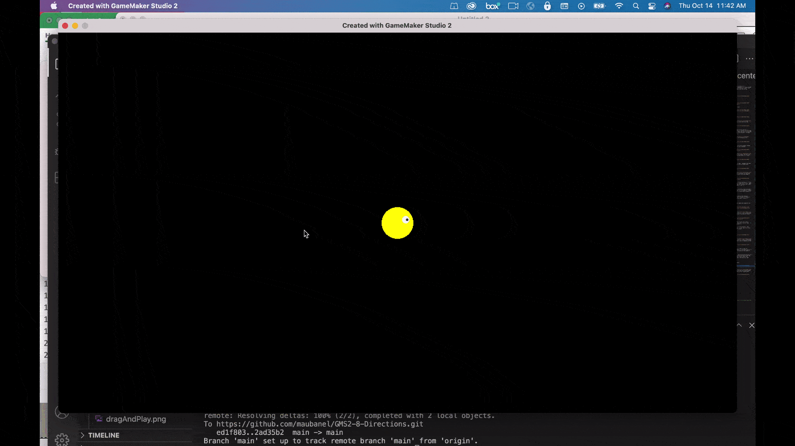

##### `Step 18.`\|`MI8D`| :large_blue_diamond: :small_orange_diamond: :small_blue_diamond: :small_blue_diamond: :small_blue_diamond:

Select the **File | Save Project** then press **File | Quit** to make sure everything in the game is saved. If you are using **GitHub** open up **GitHub Desktop** and add a title and longer description (if necessary) and press the <kbd>Commit to main</kbd> button. Finish by pressing **Push origin** to update the server with the latest changes.

___

| [home](../README.md#user-content-gms2-move-in-8-directions) | [next](../simple-8dir/README.md#user-content-simple-movement-8-directions)|
|---|---|
