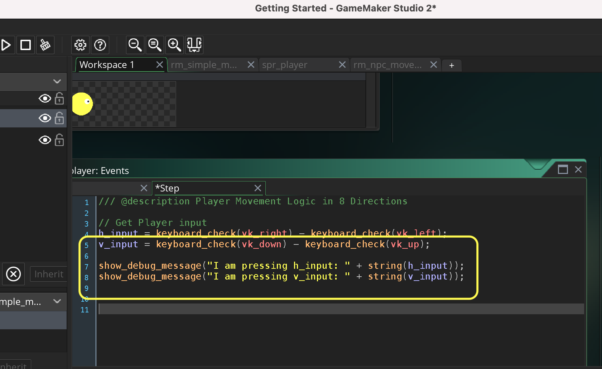
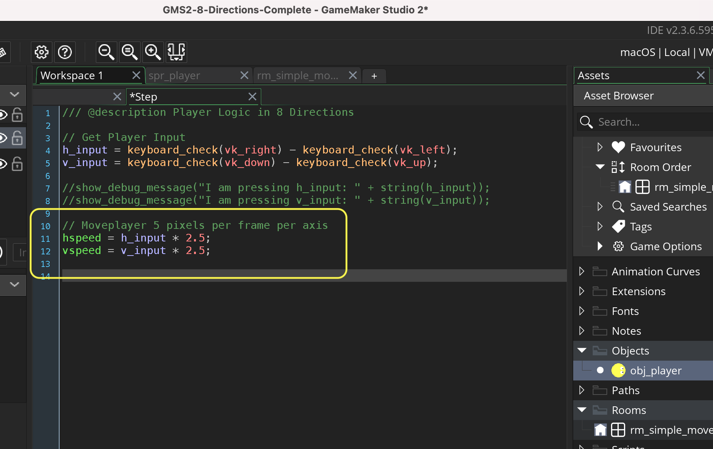

### Simple Movement in 8 Directions

[previous](../) • [home](../README.md#user-content-gms2-move-in-8-directions) • [next](../)

We will use **[hspeed](https://manual.yoyogames.com/GameMaker_Language/GML_Reference/Asset_Management/Instances/Instance_Variables/hspeed.htm)** and **[vspeed](https://manual.yoyogames.com/GameMaker_Language/GML_Reference/Asset_Management/Instances/Instance_Variables/vspeed.htm)** to move the player around the 2d level.

 

---

##### `Step 1.`\|`MI8D`|:small_blue_diamond:

Create a new level by right clicking on **Rooms** and select **Create | Room** and call it `rm_simple_movement`.  Open up **Room Order** and *drag* it to the top of the list if you have other rooms in your project.

##### `Step 2.`\|`FHIU`|:small_blue_diamond: :small_blue_diamond: 

Now lets create a sprite for our player that we will be moving.  We will create an eyeball so we can see the direction we are moving in. Right click on **Sprites** and select **Create | Sprite** and call it `spr_player`.  Now press the <kbd>Edit Image</kbd> button to go to the editor.  Select the **Circle tool** and the yellow color and draw a round circle to fill the sprite,  Add an eyeball pointing the right (0 degrees) so that we have the player oriented in our starting direction.

##### `Step 3.`\|`MI8D`|:small_blue_diamond: :small_blue_diamond: :small_blue_diamond:

*Right click* on **Objects** and select **Create | Object** and name it `obj_player`.  Assign sprite `spr_player` by pressing **Sprite** and selecting the sprite.

##### `Step 4.`\|`MI8D`|:small_blue_diamond: :small_blue_diamond: :small_blue_diamond: :small_blue_diamond:

Press the <kbd>Add Event</kbd> and add a **Create** and center the object in the dead center of the room.

##### `Step 5.`\|`MI8D`| :small_orange_diamond:

Open up **rm_simple_movement** and drag and drop a **obj_player** into the level. Now *press* the <kbd>Play</kbd> button in the top menu bar to launch the game.

##### `Step 6.`\|`MI8D`| :small_orange_diamond: :small_blue_diamond:

Open up **obj_player** and press the <kbd>Add Event</kbd> button and add a **Step | Step** event.  Now we will look at **[keyboard_check(key)](https://manual.yoyogames.com/GameMaker_Language/GML_Reference/Game_Input/Keyboard_Input/keyboard_check.htm)** and will subtract the left key from the right key.  Now `keyboard_check(key)` returns a boolean which will be 1 if true and 0 if false.  This means if *right* is pressed it will be *1-0*. If *left* is pressed it will be *0-1*.  If both right and left are pressed it will be 1-1.  So this gives us a range of -1 to 1.

Lets prove it.  We will use another new function **[show_debug_message(string)](https://manual.yoyogames.com/GameMaker_Language/GML_Reference/Debugging/show_debug_message.htm).  It will print this message in the Debugger Output window. 

##### `Step 7.`\|`MI8D`| :small_orange_diamond: :small_blue_diamond: :small_blue_diamond:

You should have an Output tab in the bottom.  If you don't see it you can select **Window | Output** and it will appear in the bottom section (you might have to expand it to see it better). Now *press* the <kbd>Play</kbd> button in the top menu bar to launch the game and press the <kbd>left</kbd> and <kbd>right</kbd> arrows (and both at the same time) then see the values being printed to reflect the outcome.

##### `Step 8.`\|`MI8D`| :small_orange_diamond: :small_blue_diamond: :small_blue_diamond: :small_blue_diamond:

Repeat the for moving up and down by looking for the object moving up or down.  Remember positive **y** is moving down so we subtract the up key from the down key.  Lets print to output this result as well.

##### `Step 9.`\|`MI8D`| :small_orange_diamond: :small_blue_diamond: :small_blue_diamond: :small_blue_diamond: :small_blue_diamond:

Now *press* the <kbd>Play</kbd> button in the top menu bar to launch the game. Look at the Output Tab and press the left, right, up and down arrow on the keyboard.  The message should print and show either a -1, 0 or 1 for both horizontal or vertical movement. Notice that this only returns a `0`,`1` or `-1` no matter what.  We will use this to multiply how many pixels we move on each axis.

##### `Step 10.`\|`MI8D`| :large_blue_diamond:

Now what is nice about having a range of -1 to 1 is that we can scale it by multiplying it.  If we want to move at a speed of 5 we can multiply this value by 5 and it will range from -5 to 5.  What we will do is set the movement component for each axis.  This is through two variables that comes with every object. **[vspeed](https://manual.yoyogames.com/GameMaker_Language/GML_Reference/Asset_Management/Instances/Instance_Variables/vspeed.htm)** and **[hspeed](https://manual.yoyogames.com/GameMaker_Language/GML_Reference/Asset_Management/Instances/Instance_Variables/hspeed.htm)**hspeed.

> hspeed is one of the "built in" properties that all instances have and defines the horizontal movement speed (along the x-axis) of the instance in pixels per step. So, an hspeed of 3 means 3 pixels of movement to the right (+x) every step, and an hspeed of -3 would mean 3 pixels of movement to the left (-x) every step. - GameMake Manual

> vspeed is one of the "built in" properties that all instances have and defines the vertical movement speed (along the y-axis) of the instance in pixels per step. So, a vspeed of 3 means 3 pixels of movement to the bottom (+y) every step, and a vspeed of -3 would mean 3 pixels of movement to the top (-y) every step.

Delete the two `show_debug_message(string)` functions and add to both the `hspeed` and `vspeed` to the object.  Now that will mean when pressing right it will multiply 1 * 5 and if you press left it will multiple -1 * 5.  So right moves 5 pixels per frame and left moves -5 pixels per frame.  Same for up and down where up will move -5 pixels up per frame and down will move 5 pixels down per frame.

##### `Step 11.`\|`MI8D`| :large_blue_diamond: :small_blue_diamond: 

##### `Step 12.`\|`MI8D`| :large_blue_diamond: :small_blue_diamond: :small_blue_diamond: 

##### `Step 13.`\|`MI8D`| :large_blue_diamond: :small_blue_diamond: :small_blue_diamond:  :small_blue_diamond: 

##### `Step 14.`\|`MI8D`| :large_blue_diamond: :small_blue_diamond: :small_blue_diamond: :small_blue_diamond:  :small_blue_diamond: 

##### `Step 15.`\|`MI8D`| :large_blue_diamond: :small_orange_diamond: 

##### `Step 16.`\|`MI8D`| :large_blue_diamond: :small_orange_diamond:   :small_blue_diamond: 

##### `Step 17.`\|`MI8D`| :large_blue_diamond: :small_orange_diamond: :small_blue_diamond: :small_blue_diamond:

##### `Step 18.`\|`MI8D`| :large_blue_diamond: :small_orange_diamond: :small_blue_diamond: :small_blue_diamond: :small_blue_diamond:

##### `Step 19.`\|`MI8D`| :large_blue_diamond: :small_orange_diamond: :small_blue_diamond: :small_blue_diamond: :small_blue_diamond: :small_blue_diamond:

##### `Step 20.`\|`MI8D`| :large_blue_diamond: :large_blue_diamond:

##### `Step 21.`\|`MI8D`| :large_blue_diamond: :large_blue_diamond: :small_blue_diamond:

___

| [previous](../)| [home](../README.md#user-content-gms2-move-in-8-directions) | [next](../)|
|---|---|---|
